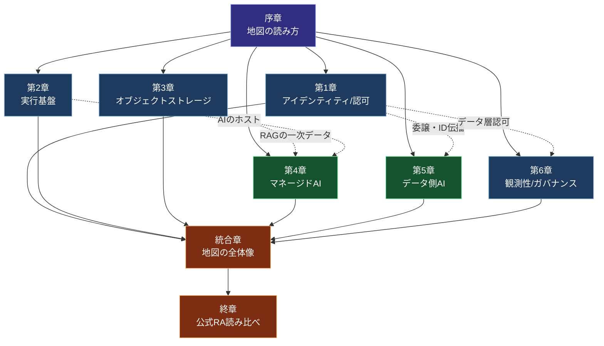

# 書籍構成・章間依存関係 (Book Architecture)

本書の章構成と、章間の依存関係（前提知識の関係）を定義する。執筆順序・読書順序の根拠となる。

## 設計思想

本書は breadth-first（全体像優先）で構成する。領域ごとに章を立て、各領域章で同じ5つのレンズ（対訳・両方向ギャップ・実現方式・SWOTスライス・新顔の分類手順）を当てる。最後に全領域を統合する。

このため、章間の依存は「方法論（序章）への依存」と「重い概念を先に置く弱い順序依存」が中心であり、領域章どうしは比較的疎結合である。読者は序章を読んだ後、関心のある領域章から読み始めることもできる。ただし通読時は番号順を推奨する。

## 部・章の全体像

```
第I部 地図の読み方
  └─ 序章   地図の読み方（軸・原点・スナップショット）★方法論の土台

第II部 土台となる部品
  ├─ 第1章  アイデンティティ／認可
  ├─ 第2章  アプリ／エージェント実行基盤
  └─ 第3章  オブジェクトストレージ

第III部 AIの中核
  ├─ 第4章  マネージドAI
  └─ 第5章  データ側AI（DB組み込み）

第IV部 運用・統合・実践
  ├─ 第6章  観測性／ガバナンス
  ├─ 統合章 地図の全体像（対訳辞書・ギャップ・SWOT集約）
  └─ 終章   公式RA読み比べ（capstone）
```

## 章間依存関係図



凡例: 実線=強い依存（前提知識）、点線=弱い依存（特定トピックの参照）

## 依存関係の詳細

| 章 | 強い前提（必読） | 弱い前提（参照） | 後続への提供 |
|----|----------------|----------------|------------|
| 序章 | なし | なし | 全章共通の方法論（軸・原点・対訳・SWOT・分類手順の枠組み） |
| 第1章 | 序章 | なし | ID／委譲の語彙（第5章のデータ層認可、第6章の行動監査で再利用） |
| 第2章 | 序章 | なし | 「マネージドAIのホスト」という位置づけ（第4章へ接続） |
| 第3章 | 序章 | なし | RAGの一次データ置き場・レイクハウス接続（第4章・第5章へ接続） |
| 第4章 | 序章 | 第2章（ホスト）, 第3章（一次データ） | マネージドAIの軸（統合章・終章で集約） |
| 第5章 | 序章 | 第1章（委譲・ID伝播→データ層認可）, 第3章（レイクハウス） | データ側AIの軸（統合章・終章で集約） |
| 第6章 | 序章 | 第1章（行動監査）, 第4章（LLM/エージェントo11y） | 運用・ガバナンスの軸（統合章で集約） |
| 統合章 | 第1〜6章 | なし | 全領域横断の対訳辞書・ギャップ一覧・SWOT（終章の語彙基盤） |
| 終章 | 統合章 | 第1〜6章すべて | 本書の軸の語彙で4社RAを読む実践（到達確認） |

## 横断テーマ（複数章にまたがる縦糸）

本書には章をまたいで繰り返し現れるテーマがある。執筆時はこれらの一貫性に注意する。

| 横断テーマ | 主に登場する章 | 一貫させるべき点 |
|----------|--------------|----------------|
| 委譲・ID伝播 | 第1章（基礎）→ 第5章（データ層）→ 第6章（監査） | Entra OBO ↔ OCI Token Exchange + Identity Propagation Trust の対応を一貫させる |
| RAG | 第3章（データ置き場）→ 第4章（マネージドRAG）→ 第5章（DB内ベクトル）→ 終章（RA） | RAGの構成要素の分解語彙を統一する |
| エージェント | 第1章（エージェントID）→ 第2章（ホスト）→ 第4章（エージェント基盤）→ 第6章（行動監査） | 「エージェント」の定義と各社製品の対応を統一する |
| データ層認可 | 第1章（委譲）→ 第5章（Deep Data Security ↔ Trusted Identity Propagation + RLS/CLS） | 認可粒度（行/列/セル）の語彙を統一する |

## 章の標準フォーマット（領域章共通）

第1〜6章は以下の固定小節構成を守る（concept §8）:

1. 軸の導入
2. 4社プロット（表）
3. 対訳（他社→OCI、`≒ / △ / なし`）
4. 両方向ギャップ
5. SWOTスライス（OCIの弱みを必ず含む）
6. 新顔の分類手順
7. 確認日

序章・統合章・終章はこの限りではなく、それぞれ方法論／集約／読解の固有構成をとる。

## 読書経路の推奨

- **通読**: 序章 → 第1〜6章（番号順）→ 統合章 → 終章
- **データ領域のギャップ埋め重視**: 序章 → 第5章 → 第4章 → 第1章 → 統合章
- **特定領域のリファレンス利用**: 序章を読んだ後、必要な領域章を単独参照（各章は自己完結的に対訳・ギャップ・SWOTを持つ）
