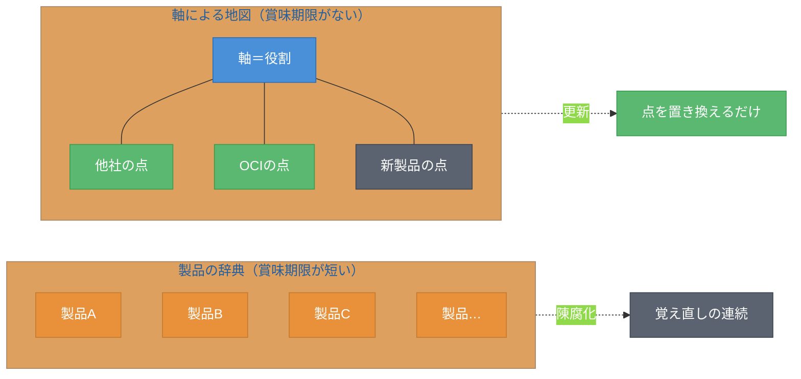
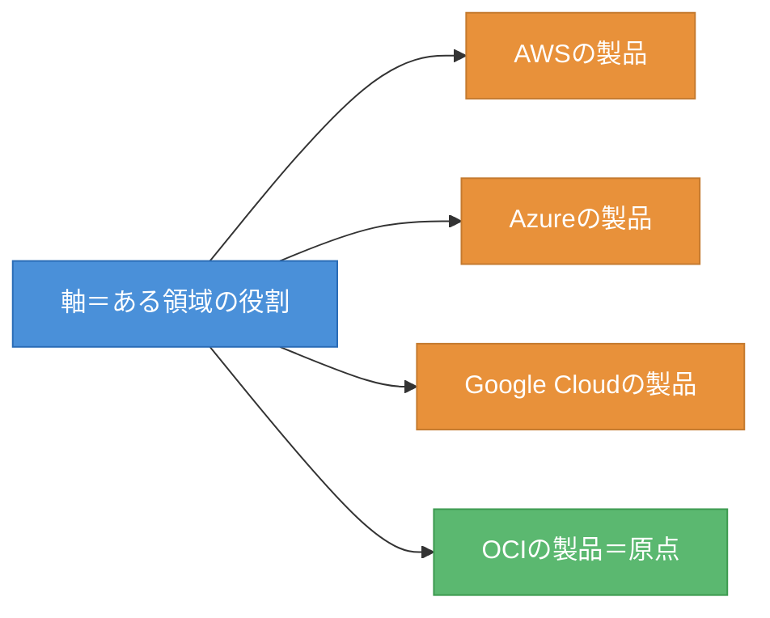
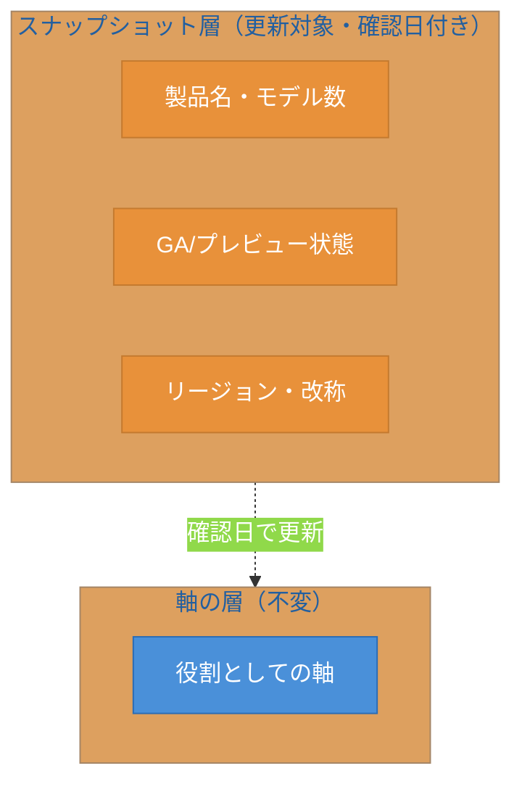
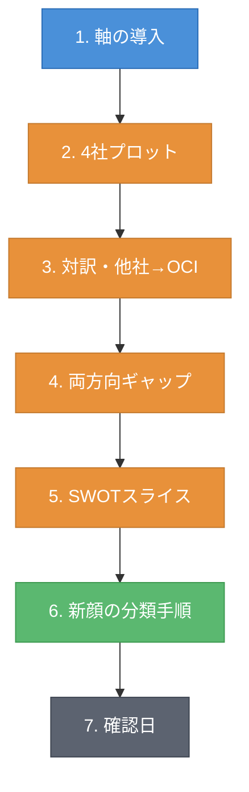

# 序章 地図の読み方 ― 軸・原点・スナップショット

本書は、AWS・Azure・Google Cloud・OCI（Oracle Cloud Infrastructure）の4社について、AIワークロードに必要な部品を横断的に並べる。ねらいは一つだけである。読み終えたとき、読者の頭の中に「クラウドAIの知識地図」ができあがることだ。本章では、その地図をどう描き、どう読むかという方法論を先に渡す。以降の全章は、ここで定義する枠組みの上に積み上げられる。

## 序.1 なぜ「製品の辞典」ではなく「地図」なのか

クラウド事業者のAI関連サービスは、毎月のように増え、名前を変え、提供状態を変える。基盤モデルの品揃えは四半期ごとに入れ替わり、サービスは改称され、プレビューはGA（General Availability、一般提供）へと進む。この速度のなかで、個々の製品名と機能を暗記する学習は賞味期限が極端に短い。覚えた直後から古くなっていく。

本書はこの問題に対して、製品を覚えるのではなく「軸」を覚えるという立場をとる。軸とは、ある領域を見通すための座標、すなわち「役割」である。製品は、その軸の上に置かれた点にすぎない。図序.1に、製品を網羅する辞典と、軸で世界を切る地図の違いを示す。

図序.1: 製品の網羅（辞典）と軸の理解（地図）の対比

辞典型の知識は、製品が一つ陳腐化するたびに覚え直しを強いる。一方、地図型の知識では、軸そのものは変わらない。変わるのは軸の上に置かれた点（製品）だけである。新しい製品に出会っても、軸が頭にあれば「この軸のここに置けばよい」と判断できる。本書が読者に渡したいのは、この置き方の能力である。これは特定の製品が消えても残る、賞味期限のない能力だ。

## 序.2 軸という考え方 ― 役割で世界を切る

軸とは役割である。たとえばアイデンティティの領域なら、「誰のIDか」「何のIDか」「どこのIdP（Identity Provider、認証基盤）を信頼するか」といった問いが軸になる。製品名から入るのではなく、まず役割で領域を切り、その役割を各社がどの製品で満たしているかを見る。覚えるのは役割（軸）であって、製品名ではない。

本書は各領域に対して、同じ5つのレンズを当てる。対訳・両方向ギャップ・実現方式・SWOTスライス・新顔の分類手順である。同じレンズを全領域に当てるからこそ、領域をまたいだ比較が成立する。図序.2に、1本の軸の上に4社の製品を配置する模式を示す。

図序.2: 1本の軸の上に4社の製品を点として配置した模式図

ここで重要なのは、軸は不変だがプロット（点）は更新対象だという区別である。役割そのものは技術トレンドが変わっても残りやすい。たとえば「ワークロードにIDを与える」という役割は、製品が入れ替わっても消えない。一方、その役割を満たす具体的な製品名は変わり続ける。本書はこの二つを常に分けて書く。

## 序.3 OCIを原点に置く理由

すべてを相対座標で語るには、基準点が要る。地図に原点がなければ、どの点も位置を持てない。本書はその原点をOCIに置く。本書の一次読者がOCIを母艦とする実務者だからである。その読者にとっては、「他社の製品はOCIでは何に相当するか」に即答できることが最も役に立つ。

原点をOCIにするのは、読者の利便のための選択であって、優劣の主張ではない。本書は「OCIではここ、他社はここ」という相対座標で各製品を語る。その対応づけを簡潔に示すため、対訳の記号を導入する。表序.1にその定義を示す。

表序.1: 対訳記号の定義と使い分け

| 記号 | 意味 | 使う場面 |
|------|------|---------|
| ≒ | ほぼ相当する | 役割・実現方式が対応し、置き換えて理解してよい場合 |
| △ | 部分的に相当する | 一部の機能のみ対応、または実現方式が異なる場合 |
| なし | 直接相当するものがない | OCIに対応物が存在しない、または大きく異なる場合 |

この3記号は全領域章で共通に使う。他社の代表製品を引いたとき、OCI相当が ≒・△・なし のどれかで即座に分かる状態をつくる。≒ が並ぶ領域は成熟して横並びの領域であり、△ や なし が現れる箇所こそ、各社の設計思想の差が出るところである。

## 序.4 スナップショットと軸の分離 ― 陳腐化への備え

本書が扱う事実のうち、モデル数・GA/プレビューの状態・対応リージョン・ブランドの改称は、いずれも急速に陳腐化する。たとえば基盤モデルの提供基盤は短期間で改称されることがあり、データベース製品のバージョン呼称も変わる。これらを断定的に書けば、本書はすぐに古くなる。

そこで本書は、図序.3に示す二層構造で事実を扱う。下層は不変の「軸」、上層は更新対象の「スナップショット（確認日時点の製品・状態の記録）」である。

図序.3: 軸（不変）とスナップショット（更新対象）の二層構造

この構造を支えるのが、出典主義と確認日である。本書は各事実を一次情報（各社公式ドキュメント、公式ブログ、リリースノート）に辿れる形で書く。陳腐化しやすい事実には確認日を付し、章末に「確認日」を明記する。本書全体の基準日は2026-06-09である。

そして、一次情報で確認できなかった主張は断定せず「要確認」と明示する。マーケティング的な優位主張は避け、出典のある範囲に限定する。これは読者がマーケティング的なフレーミングではなく事実を求めているからであり、本書の品質の核である。

## 序.5 本書の使い方と各章の読み方

本書の中心は第1章から第6章の領域章である。各領域章は同じ固定フォーマットで書かれている。図序.4にその流れを示す。

図序.4: 領域章の固定フォーマットと読み進め方

各領域章はまず軸を立て（1）、4社の製品を軸上に並べ（2）、他社製品のOCI相当を対訳記号で示す（3）。続いて「他社にあってOCIにない」「OCIにあって他社にない」を双方向で挙げ（4）、その領域に限ったSWOT（強み・弱み・機会・脅威）を切り出す（5）。ここでOCIの弱みを必ず含める。最後に、未知の新製品を軸上に置く再現可能な手順を示し（6）、章末に確認日を付す（7）。

論点が立つ要件、たとえば委譲・ID伝播やデータ層の認可は、ケイパビリティ・カードという定型で深掘りする。カードは「課題／OCIでの実現／他社での実現／差分の見立て／確認日」の5項目からなる。

読み方は読者の目的に応じて選べる。通読するなら序章のあと第1章から番号順に進み、統合章・終章で締めるとよい。データ領域のギャップを埋めたいなら、第5章（データ側AI）と第4章（マネージドAI）を先に読む経路もある。各領域章は自己完結的に対訳・ギャップ・SWOTを持つため、必要な領域だけを単独で参照することもできる。

本書はこのあと、すべてのAIワークロードの土台となる最初の軸、すなわちアイデンティティ／認可から地図を描き始める。土台から積み上げていく。

## 理解度チェック

### Q1. 軸とプロットの分離

**種類**: 概念の確認

**難易度**: 基礎

**問題文**:
本書が「軸」と「プロット（製品）」を分離して扱う理由を、陳腐化という観点から説明せよ。

解答と解説

**解答**: 軸（役割）は技術トレンドが変わっても残りやすい不変の知識であるのに対し、プロット（製品名・モデル数・提供状態）は急速に陳腐化するため、両者を分離することで、製品が古くなっても軸の知識は再利用でき、更新は点の置き換えだけで済むから。

**解説**: 製品を暗記する辞典型の学習は、製品が陳腐化するたびに覚え直しを強いる。軸を覚える地図型の学習なら、新製品も軸上に置き直すだけでよい。本書はこの再利用可能性を重視し、軸を不変層、プロットを更新対象層とする二層構造で事実を扱う。

**関連する節**: 序.1、序.2、序.4

---

### Q2. 対訳記号の使い分け

**種類**: 判断問題

**難易度**: 基礎

**問題文**:
ある他社製品が、OCIの製品と「役割は同じだが一部の機能のみ対応し、実現方式も異なる」場合、本書ではどの対訳記号を使うべきか。理由とともに答えよ。

**選択肢**:
- (a) ≒
- (b) △
- (c) なし
- (d) 記号は付けない

解答と解説

**解答**: (b) △

**解説**: ≒ は「役割・実現方式が対応し置き換えて理解してよい」場合、なし は「直接相当するものがない」場合に使う。設問は「一部の機能のみ対応、実現方式が異なる」状況であり、これは部分的に相当する △ に該当する。△ が現れる箇所こそ各社の設計思想の差が出る注目点である。

**関連する節**: 序.3

---

### Q3. 確認できない事実の扱い

**種類**: 判断問題

**難易度**: 基礎

**問題文**:
ある製品の最新の提供状態（GAかプレビューか）を、一次情報で確認できなかった。本書の方針では、この事実をどのように記述すべきか。

解答と解説

**解答**: 断定せず「要確認」と明示する。あわせて、その記述がスナップショット層（更新対象）であることが分かるよう、確認日とともに扱う。

**解説**: 本書は出典主義をとり、各事実を一次情報に辿れる形で書く。確認できない主張を断定すると、誤った情報を固定してしまう。陳腐化しやすい事実は確認日を付し、確認できないものは「要確認」と明示するのが本書の方針である。

**関連する節**: 序.4

---

### Q4. 新顔を地図に置く

**種類**: 設計問題

**難易度**: 応用

**問題文**:
ある領域章を読んだ読者が、その後に発表された未知の新製品に出会った。本書の領域章の固定フォーマット（序.5）を踏まえ、この新製品を地図の正しい位置に置くために、読者がたどるべき手順を順を追って設計せよ。

解答と解説

**解答**: (1) その新製品が属する領域を特定する。(2) その領域章で立てた軸（役割）を思い出す。(3) 新製品が軸上のどの役割を満たすかを判断し、点として置く。(4) 既存の他社製品・OCI製品と対訳（≒／△／なし）で対応づける。(5) その新製品が「他社にありOCIにない」「OCIにあり他社にない」のいずれに当たるかを確認する。(6) 確認日を付して、スナップショットとして記録する。

**解説**: 本書の領域章は固定フォーマット（軸の導入→4社プロット→対訳→両方向ギャップ→SWOTスライス→新顔の分類手順→確認日）で構成される。読者はこの順序を逆向きにたどることで、新製品を自力で地図に置ける。軸（不変）に置くことが核心であり、製品名（更新対象）は確認日付きのスナップショットとして扱う。これが本書の到達目標である「賞味期限のない能力」にあたる。

**関連する節**: 序.2、序.5

---

## 確認日

- 本章の基準日: 2026-06-09
- 本章は本書の方法論を述べる章であり、特定製品の陳腐化しやすい事実への依存はない。各領域章のスナップショット依存事実は、それぞれの章末の確認日に従う。
