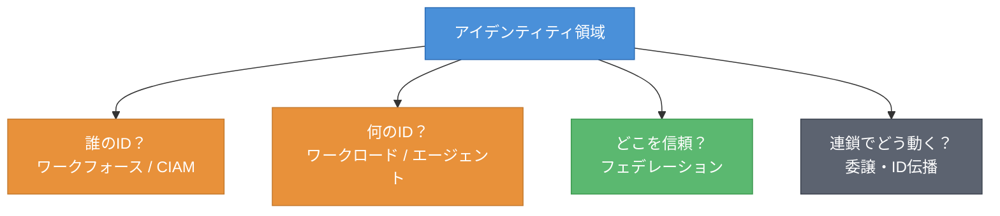
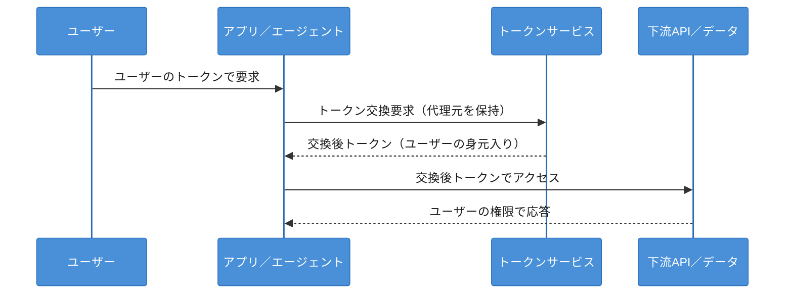
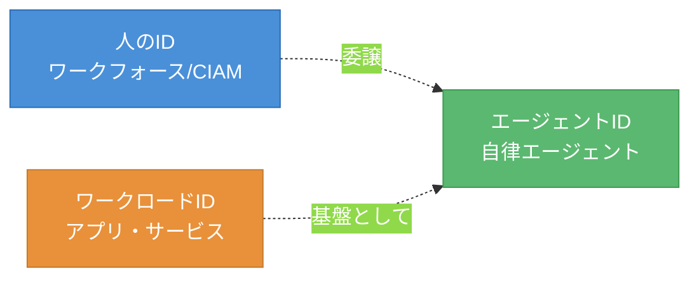
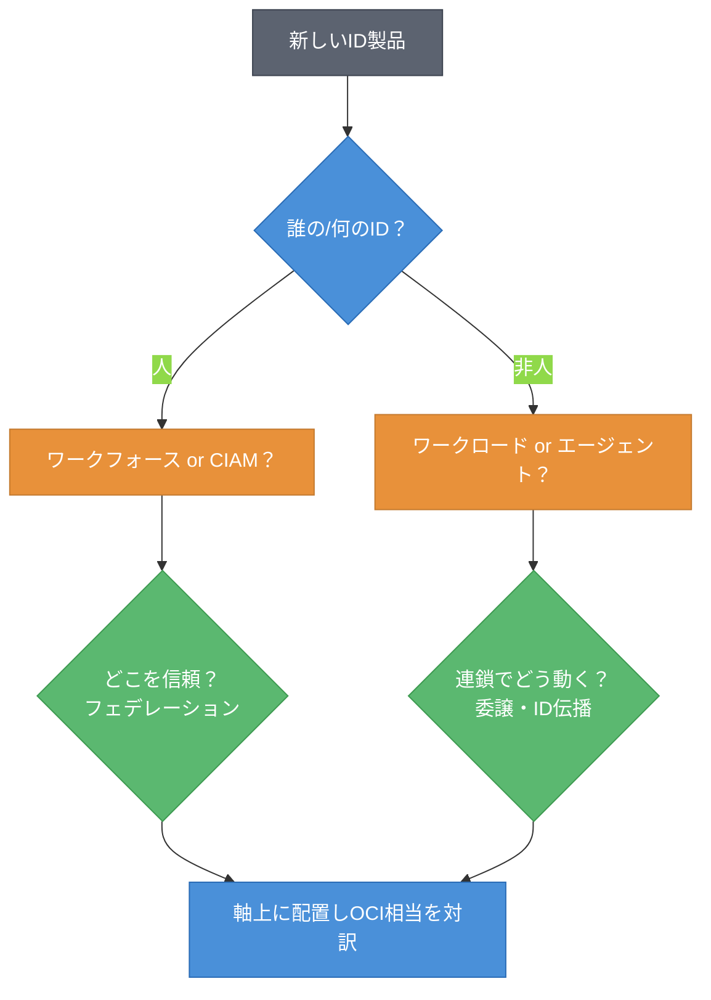

# 第1章 アイデンティティ／認可 ― ワークフォース・CIAM・ワークロードID・委譲

序章では、製品ではなく軸を覚えること、すべてをOCIを原点とする相対座標で語ること、そして陳腐化しやすい事実を確認日付きのスナップショットとして扱うことを述べた。本章からは、その方法論を実際の領域に当てていく。最初の軸として選ぶのはアイデンティティ／認可である。あらゆるAIワークロードは「誰として動くか」から始まる。人もアプリも、そしてAIエージェントも、まずIDを持たなければ何もできない。本章を読み終えると、4社のID関連製品を「誰の・何の・どこを信頼・連鎖でどう動く」という軸の上に置けるようになる。

## 1.1 軸の導入 ― アイデンティティを4つの問いで切る

アイデンティティの領域は製品が多く、名前も紛らわしい。これを見通すために、本書は4つの問いを軸として立てる。図1.1にその4軸を示す。



図1.1: アイデンティティ領域を切る4つの軸

第1の問いは「誰のID」である。これは2つに分かれる。社内の従業員に与えるワークフォースID（Workforce Identity）と、外部の顧客に与えるCIAM（Customer Identity and Access Management、顧客向けID管理）である。両者は要件が大きく異なる。ワークフォースは組織のディレクトリと統制が中心で、CIAMは大量の外部ユーザー・ソーシャルログイン・セルフサービス登録が中心となる。

第2の問いは「何のID」である。人ではなく、アプリケーションやサービスに与えるワークロードID（Workload Identity）を指す。近年はここにAIエージェントのID（エージェントID）という新しい論点が加わった。第3の問いは「どこのIdPを信頼するか」、すなわちフェデレーション（Federation）である。第4の問いは「呼び出しの連鎖のなかで、最終的に誰として動くか」、すなわち委譲（Delegation）とID伝播（Identity Propagation）である。AIエージェントが人に代わって複数のサービスやデータを呼ぶ時代には、この第4の軸が最大の論点になる。

これら4つの問いは、製品が入れ替わっても残る。新しいID製品に出会ったら、まず「この製品は4つの問いのどれに答えるものか」を考えればよい。

## 1.2 4社プロット ― 各社のID製品を軸上に置く

4つの軸ができたので、4社の代表製品を軸上に並べる。表1.1に4社プロットを示す。製品名はスナップショットであり、確認日（2026-06-09）時点のものである。

表1.1: アイデンティティの4社プロット（軸×4社、確認日 2026-06-09）

| 軸 | AWS | Azure | Google Cloud | OCI（原点） |
|----|-----|-------|--------------|------|
| ワークフォースID | IAM Identity Center | Microsoft Entra ID | Cloud Identity | IAM with Identity Domains |
| CIAM | Amazon Cognito | Microsoft Entra External ID | Identity Platform | IAM with Identity Domains |
| ワークロードID | IAMロール / IRSA | Entra Workload ID | Workload Identity 連携 | インスタンス／リソースプリンシパル |
| フェデレーション | SAML / OIDC 連携 | Entra フェデレーション | Workforce Identity 連携 | Identity Domains 連携 |
| 委譲・ID伝播 | Trusted Identity Propagation | Entra OBO | （IAM／IAP の組み合わせ） | Token Exchange ＋ Identity Propagation Trust |

ここで注目すべき構造の違いがある。OCIは「IAM with Identity Domains」という一つの枠組みのなかで、ワークフォースとCIAMの双方を扱う。これに対しAzureはワークフォース（Entra ID）とCIAM（Entra External ID）を別の製品として提供する。AWSもワークフォース（IAM Identity Center）とCIAM（Cognito）を分けている[^1]。Google Cloud も Cloud Identity と Identity Platform に分かれる。統合の度合いはOCIが高い。

ワークロードIDの実現方式は各社で差が大きい。AWSはIAMロールとIRSA（IAM Roles for Service Accounts）でKubernetes上のワークロードにIDを与える。OCIはインスタンスプリンシパル／リソースプリンシパルという仕組みで、計算リソース自体にIDを与える。実現の語彙が異なるため、対訳が必要になる。

## 1.3 対訳（他社→OCI）

代表製品のOCI相当を、対訳記号 ≒／△／なし で示す。表1.2に対訳表を示す。

表1.2: アイデンティティ対訳表（他社→OCI、確認日 2026-06-09）

| 他社製品 | OCI相当 | 記号 | 注記 |
|---------|---------|------|------|
| Microsoft Entra ID（ワークフォース） | IAM with Identity Domains | ≒ | ワークフォースSSO・ディレクトリとして対応 |
| Amazon Cognito（CIAM） | IAM with Identity Domains | ≒ | CIAM機能として対応。大規模CIAM特化機能には差 |
| Cloud Identity | IAM with Identity Domains | ≒ | ワークフォース管理として対応 |
| Entra Workload ID | インスタンス／リソースプリンシパル | △ | 実現方式が異なる。考え方は対応 |
| Entra OBO | Token Exchange ＋ Identity Propagation Trust | △ | 標準（RFC 8693）ベースで対応（1.4で詳述） |
| Entra Agent ID（GA済み） | （プリンシパル＋伝播で組み立て） | なし／△ | Azureは専用製品をGA。OCIは専用製品を持たず組み立てで対応（1.5で詳述） |

≒ が並ぶのは、ワークフォース・CIAMという成熟した役割である。一方、ワークロードID（△）、委譲・ID伝播（△）、エージェントID（なし／△）には差が現れる。差が出る箇所こそ、この後のケイパビリティ・カードで深掘りする価値がある。

## 1.4 ケイパビリティ・カード ― 委譲・ID伝播

AIワークロードで最も重要なID論点が、委譲・ID伝播である。これを定型カードで深掘りする。

### ケイパビリティ・カード: 委譲・ID伝播

- **課題**: アプリやエージェントが、ユーザーに代わって下流のAPIやデータにアクセスするとき、「アプリの権限」ではなく「元のユーザーの権限」で動いてほしい。代理元（元のユーザー）の身元を保持したまま連鎖をたどりたい。
- **OCIでの実現**: OAuth 2.0 Token Exchange（RFC 8693）でトークンを交換し、Identity Propagation Trust の設定により外部IdPからのIDを信頼して伝播する。impersonation（なりすまし）の形で代理元を保持する[^2]。
- **他社での実現**: Azure は Entra の OBO（On-Behalf-Of）フローでユーザーのトークンを下流API用に交換する。AWS は Trusted Identity Propagation でユーザーIDをデータサービスまで伝える。Google Cloud は IAM と IAP（Identity-Aware Proxy）の組み合わせで近い目的を満たす。
- **差分の見立て**: OCIの Token Exchange は RFC 8693 という標準に基づく点が見立てやすい。Azure の OBO も実態は同種のトークン交換である。実現の核は各社とも標準的なトークン交換であり、ここは横並びに近い。差が出るのは「伝播した先のデータ層でどこまできめ細かく認可できるか」であり、これは第5章のデータ層認可に続く。
- **確認日**: 2026-06-09

図1.2に、OBO と Token Exchange のフローを対比して示す。



図1.2: 委譲・ID伝播のフロー（OBO と Token Exchange に共通する骨格）

実際のトークン交換は、RFC 8693 が定めるパラメータで行う。リスト1.1に、Token Exchange リクエストの骨格を示す（概念例）。

**リスト1.1: RFC 8693 Token Exchange リクエスト／レスポンス（概念例・疑似コード）**

```http
POST /oauth2/token HTTP/1.1
Host: idp.example.com
Content-Type: application/x-www-form-urlencoded

grant_type=urn:ietf:params:oauth:grant-type:token-exchange
&subject_token=<元のユーザーのトークン>
&subject_token_type=urn:ietf:params:oauth:token-type:jwt
&requested_token_type=urn:ietf:params:oauth:token-type:access_token
&audience=<下流APIの識別子>
```

```json
// レスポンス（代理元の身元を保持した交換後トークンを返す）
{
  "issued_token_type": "urn:ietf:params:oauth:token-type:access_token",
  "access_token": "<交換後トークン>",
  "token_type": "Bearer",
  "expires_in": 3600
}
```

このように、委譲・ID伝播の核は標準的なトークン交換である。各社の製品名は違っても、骨格は共通している。軸（役割）で見れば横並びに見え、差は伝播先での認可粒度に現れる。

## 1.5 ケイパビリティ・カード ― エージェントID

AIエージェントが自律的に動く時代には、エージェント自身にIDを与える必要が生じる。これは発展途上の領域であり、陳腐化が速い。確認日付きで扱う。

### ケイパビリティ・カード: エージェントID

- **課題**: AIエージェントが人とは独立に行動し、APIやデータにアクセスする。そのとき「どのエージェントが」「誰の委譲を受けて」動いたかを識別・統制・監査したい。人のIDでもなく、従来のワークロードIDだけでも足りない。
- **OCIでの実現**: 専用の「エージェントID製品」を前面に出すよりも、既存のワークロードID（プリンシパル）と委譲・ID伝播（Token Exchange ＋ Identity Propagation Trust）を組み合わせて構成する方向である。専用ブランドの製品は確認日時点では確立しておらず、組み立てで対応する。
- **他社での実現**: Azure は Microsoft Entra Agent ID として、エージェントに第一級のIDを与える専用製品を一般提供している（2026-05-01 GA）[^3]。Agent Identity Blueprint、Agent Identity、エージェント向けOBO（Agent User Account）、Entra ID Governance による統制といった構成要素を持ち、Microsoft Agent 365 の一部として提供される。AWS・Google Cloud もエージェント向けのID統制を整えつつある。
- **差分の見立て**: エージェント専用IDの領域では、専用製品をGAしている Azure が明確に先行する。「エージェントが委譲を受けて動く」という本質はワークロードID＋伝播の組み合わせで表現でき、OCIはその組み立てで対応する。しかし専用製品としての成熟度・統制機能の作り込みでは、OCIは追う立場であり、これはこの領域でのOCIの弱みである。
- **確認日**: 2026-06-09

図1.3に、人・ワークロード・エージェントのIDの位置づけを示す。



図1.3: エージェントIDの位置づけ（人のIDからの委譲とワークロードIDの延長）

エージェントIDは、人のIDからの委譲を受けつつ、ワークロードIDの延長線上に立つ。専用製品が現れても、この位置づけは変わらない。新しいエージェントID製品に出会ったら、「人からの委譲をどう表現し、どのワークロードIDの上に立つか」を見ればよい。

## 1.6 両方向ギャップとSWOTスライス

この領域の両方向ギャップと、各社のSWOTスライスを表1.3にまとめる。OCIの弱みを必ず含める。

表1.3: アイデンティティ領域の両方向ギャップとSWOTスライス（確認日 2026-06-09）

| 観点 | 内容 |
|------|------|
| 他社にありOCIにない | エージェント専用ID製品（例: Entra Agent ID、2026-05-01 GA）、大規模CIAM特化の高度機能の一部 |
| OCIにあり他社にない | ワークフォースとCIAMを単一の Identity Domains で統合的に扱う設計。データ層認可（第5章）への一貫した伝播の素地 |
| AWS（強み/弱み） | S: 広範なサービスとの統合、Trusted Identity Propagation。W: ワークフォースとCIAMが別製品で学習コスト |
| Azure（強み/弱み） | S: Entra のエンタープライズ浸透、エージェントID先行。W: 製品群が多く全体像が複雑 |
| Google Cloud（強み/弱み） | S: シンプルな構成、Workload Identity 連携。W: CIAM特化機能の訴求が相対的に弱い |
| OCI（強み/弱み） | S: Identity Domains の統合度、標準ベースの伝播。**W: エージェント専用ID製品の成熟度、CIAM特化の高度機能で見劣りしうる** |

ギャップは双方向に存在する。OCIは統合度と標準準拠に強みを持つ一方、エージェント専用製品の成熟度では他社に追う立場になりうる。これを隠さず記すのが本書の方針である。

## 1.7 新顔の分類手順と確認日

最後に、未知のID系新製品を地図に置く手順を示す。図1.4にフローチャートを示す。



図1.4: ID系新製品の分類フローチャート

手順は単純である。まず「誰の／何のID」かを判定し（人か非人か）、人ならワークフォースかCIAMか、非人ならワークロードかエージェントかを決める。次に「どこを信頼するか（フェデレーション）」「連鎖でどう動くか（委譲・ID伝播）」を確認する。最後に軸上に置き、OCI相当を対訳記号で対応づける。4つの問いに当てれば、新製品も迷わず地図に載る。

本章では、IDで「誰として動くか」が定まることを見た。委譲・ID伝播の核は標準的なトークン交換であり、各社は横並びに近い。差はむしろ、伝播した先のデータ層でどこまできめ細かく認可できるかに現れる。これは第5章で詳しく扱う。次の章では、このIDを持つアプリ／エージェントが「どこで動くか」、すなわち実行基盤へと地図を進める。

## 理解度チェック

### Q1. ワークフォースID・CIAM・ワークロードID

**種類**: 概念の確認

**難易度**: 基礎

**問題文**:
ワークフォースID・CIAM・ワークロードIDの3つの違いを、それぞれが「誰の／何のID」かに着目して説明せよ。

<details>
<summary>解答と解説</summary>

**解答**: ワークフォースIDは社内の従業員（人）に与えるID、CIAMは外部の顧客（人）に与えるID、ワークロードIDは人ではないアプリケーションやサービスに与えるIDである。ワークフォースは組織ディレクトリと統制が中心、CIAMは大量の外部ユーザー・ソーシャルログイン・セルフサービス登録が中心、ワークロードIDは計算リソースやアプリにIDを与える点が異なる。

**解説**: 本書は「誰の／何のID」という問いを第1の軸に置く。人のID（ワークフォース／CIAM）と非人のID（ワークロード／エージェント）を分けることが、製品を整理する出発点になる。

**関連する節**: 1.1、1.2

</details>

---

### Q2. Entra OBO の対訳

**種類**: 判断問題

**難易度**: 応用

**問題文**:
Azure の Entra OBO（On-Behalf-Of）は、OCIのどの仕組みに相当するか。対訳記号付きで答え、その理由を述べよ。

**選択肢**:
- (a) インスタンスプリンシパル（≒）
- (b) Token Exchange ＋ Identity Propagation Trust（△）
- (c) IAM with Identity Domains（≒）
- (d) 相当物なし

<details>
<summary>解答と解説</summary>

**解答**: (b) Token Exchange ＋ Identity Propagation Trust（△）

**解説**: OBO はアプリがユーザーに代わって下流APIを呼ぶためのトークン交換フローである。OCIでは OAuth 2.0 Token Exchange（RFC 8693）と Identity Propagation Trust の組み合わせが同じ役割を果たす。実現方式の核（標準的なトークン交換）は共通だが、設定・用語が異なるため △ とする。

**関連する節**: 1.3、1.4

</details>

---

### Q3. 委譲・ID伝播の核

**種類**: 概念の確認

**難易度**: 基礎

**問題文**:
本章は「委譲・ID伝播は各社で横並びに近く、差はむしろ別の場所に現れる」と述べた。差が現れるのはどこか。

<details>
<summary>解答と解説</summary>

**解答**: 伝播した先のデータ層で、どこまできめ細かく（行／列／セル単位で）認可できるか。

**解説**: 委譲・ID伝播の核は標準的なトークン交換（RFC 8693 等）であり、各社とも骨格は共通する。差が出るのは、伝播したユーザーIDをデータ層でどこまで一貫してきめ細かく認可できるかである。これは第5章のデータ層認可（Deep Data Security 等）に続く論点である。

**関連する節**: 1.4、1.6

</details>

---

### Q4. 新しいエージェントID製品を地図に置く

**種類**: 設計問題

**難易度**: 応用

**問題文**:
ある事業者が「自律エージェント向けの新しいID管理サービス」を発表した。本章の新顔の分類手順（1.7）に沿って、この製品を地図のどこに置くか、判断の手順を設計せよ。

<details>
<summary>解答と解説</summary>

**解答**: (1) まず「誰の／何のID」かを判定する。自律エージェント向けなので「非人のID」であり、ワークロードIDの延長＝エージェントIDの軸に置く。(2) 次に「人からの委譲をどう表現するか（委譲・ID伝播）」を確認する。(3) その実現が標準的なトークン交換に基づくかを見る。(4) OCI相当を対訳で対応づける。OCIは専用製品ではなくワークロードID＋伝播の組み立てで対応するため、記号は なし／△ となる可能性が高い。(5) 確認日を付してスナップショットとして記録する。

**解説**: エージェントIDは「人のIDからの委譲を受け、ワークロードIDの延長線上に立つ」という位置づけ（図1.3）が不変である。新製品もこの位置づけと委譲の表現方法で整理できる。専用製品の有無はスナップショットであり、確認日付きで扱う。

**関連する節**: 1.5、1.7

</details>

---

## 参考文献

- Internet Engineering Task Force "RFC 8693: OAuth 2.0 Token Exchange" (2020), https://www.rfc-editor.org/rfc/rfc8693 （確認日: 2026-06-09）
- Oracle "Token Exchange (JWT to UPST) / Identity Propagation Trust" , https://docs.oracle.com/en-us/iaas/Content/Identity/api-getstarted/json_web_token_exchange.htm （確認日: 2026-06-09）
- Microsoft "Microsoft Entra Agent ID documentation" , https://learn.microsoft.com/en-us/entra/agent-id/what-is-microsoft-entra-agent-id （確認日: 2026-06-09）
- Microsoft "On-behalf-of (OBO) flow" , https://learn.microsoft.com/en-us/entra/identity-platform/v2-oauth2-on-behalf-of-flow （確認日: 2026-06-09）
- Microsoft "Microsoft Entra External ID documentation" , https://learn.microsoft.com/en-us/entra/external-id/ （確認日: 2026-06-09）
- Amazon Web Services "Trusted identity propagation / Amazon Cognito" , https://docs.aws.amazon.com/singlesignon/latest/userguide/trustedidentitypropagation-overview.html （確認日: 2026-06-09）
- Google "Identity products (Cloud Identity / Identity Platform)" , https://docs.cloud.google.com/docs/authentication/identity-products （確認日: 2026-06-09）

[^1]: 各社のワークフォース／CIAM製品の区分は公式ドキュメントに基づく。Entra External ID は2024-05-15にGAした次世代CIAM（旧 Azure AD B2C の後継）である。製品名・区分は改称されうるため確認日付きで扱う（確認日: 2026-06-09）。

[^2]: OCIの Token Exchange（JWTからUPSTへの交換）と Identity Propagation Trust によるID伝播・impersonationの詳細は Oracle 公式ドキュメントを参照。allowImpersonation の設定と、発行トークンに含まれる source_authn_prin クレームにより代理元の身元を保持・監査できる。https://docs.oracle.com/en-us/iaas/Content/Identity/api-getstarted/json_web_token_exchange.htm （確認日: 2026-06-09）

[^3]: Microsoft "What is Microsoft Entra Agent ID"（2026-05-01 GA）, https://learn.microsoft.com/en-us/entra/agent-id/what-is-microsoft-entra-agent-id （確認日: 2026-06-09）

## 確認日

- 本章の基準日: 2026-06-09
- 特に陳腐化しやすい項目: Entra External ID／Entra Agent ID 等のブランド名と提供状態、OCI Identity Propagation Trust の機能範囲、各社ワークロードID実現方式の細部。次回更新時に各社公式ドキュメントで再確認すること。
