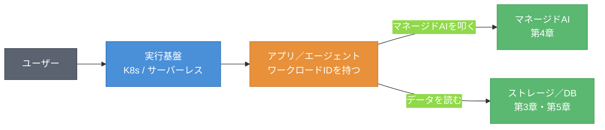
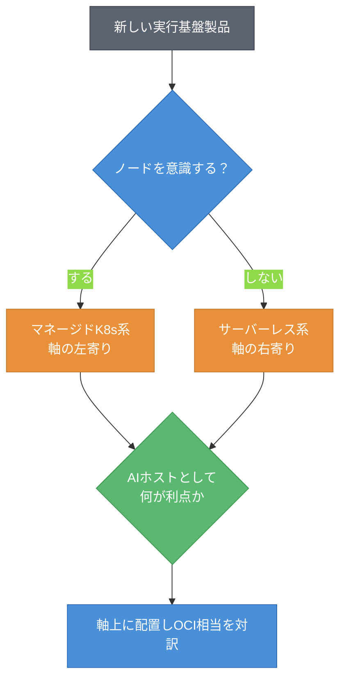

# 第2章 アプリ／エージェント実行基盤 ― マネージドK8s・サーバーレス・レジストリ

第1章では、IDによって「誰として動くか」が定まることを見た。委譲・ID伝播の核は標準的なトークン交換であり、各社は横並びに近いことも確認した。本章では、そのIDを持つアプリやエージェントが「どこで動くか」、すなわち実行基盤へと地図を進める。ただし本書は実行基盤を主役には置かない。実行基盤はあくまで「マネージドAIを叩くアプリ／エージェントのホスト」として、最小限に扱う。本章を読み終えると、4社のコンテナ実行基盤を「管理をどこまで事業者に手放すか」という軸の上に置けるようになる。

## 2.1 軸の導入 ― 実行基盤を「管理の手放し度」で切る

コンテナの実行基盤は製品が多いが、見通す軸は一つで足りる。「管理をどこまで事業者に手放すか」である。図2.1にこの軸を示す。

図2.1: 管理の手放し度の軸（マネージドKubernetesからサーバーレスコンテナまで）

軸の左端は、自分で多くを管理するマネージドKubernetes（Managed Kubernetes）である。コントロールプレーンは事業者が管理するが、ワーカーノードの設計・運用は利用者の責任が残る。軸を右に進むと、ノードの運用すら事業者に委ねる自動運用モードがあり、さらに右端には、ノードの概念を意識しないサーバーレスコンテナ（Serverless Container）がある。

本書はこの軸を「AIアプリ／エージェントのホスト」という視点で見る。すなわち、実行基盤そのものをAIのランタイムとして深掘りするのではなく、マネージドAIサービス（第4章）を呼び出すアプリケーションを、どこで動かすかという観点で扱う。この割り切りにより、コンテナ基盤の膨大な機能のうち、AIワークロードのホストとして本質的な部分だけを地図に載せる。

## 2.2 4社プロット ― K8s・サーバーレス・レジストリ

軸ができたので、4社の製品を並べる。実行基盤は3つの小領域（マネージドKubernetes、サーバーレスコンテナ、コンテナレジストリ）に分かれる。表2.1に4社プロットを示す。

表2.1: 実行基盤の4社プロット（確認日 2026-06-09）

| 小領域 | AWS | Azure | Google Cloud | OCI（原点） |
|--------|-----|-------|--------------|------|
| マネージドKubernetes | Amazon EKS（Elastic Kubernetes Service） | Azure Kubernetes Service（AKS） | Google Kubernetes Engine（GKE） | OKE（Oracle Container Engine for Kubernetes） |
| ノード自動運用 | EKS Auto Mode | AKS（ノードプール自動化） | GKE Autopilot | OKE 仮想ノード |
| サーバーレスコンテナ | AWS Fargate | Azure Container Apps | Cloud Run | OCI Container Instances |
| コンテナレジストリ | Amazon ECR（Elastic Container Registry） | Azure Container Registry（ACR） | Artifact Registry | OCI Registry（OCIR） |

4社とも、マネージドKubernetesとサーバーレスコンテナの二層構造を持つ。どの社でも、Kubernetesで細かく制御する選択肢と、サーバーレスで運用を手放す選択肢が用意されている。コンテナレジストリも各社が1つずつ持ち、ほぼ横並びである。

注目すべきは「ノード自動運用」の層である。Google Cloud の GKE Autopilot は、ノード運用を事業者に委ねるモードとして早くから知られる[^1]。AWSも EKS Auto Mode で同様の方向に進み、OCIは仮想ノードでノード管理の負担を下げる。この層は各社の作り込みに差が出やすい。なお OKE の仮想ノードは、公式にはサーバーレスKubernetesと位置づけられ、ワーカーノードを意識しない点で自動運用層のなかでも軸の右寄り（サーバーレス寄り）に位置する。

## 2.3 対訳（他社→OCI）

代表製品のOCI相当を対訳記号で示す。表2.2に対訳表を示す。

表2.2: 実行基盤の対訳表（他社→OCI、確認日 2026-06-09）

| 他社製品 | OCI相当 | 記号 | 注記 |
|---------|---------|------|------|
| Amazon EKS | OKE | ≒ | マネージドKubernetesとして対応 |
| AKS | OKE | ≒ | 同上 |
| GKE | OKE | ≒ | 同上。Autopilot相当の自動運用は作り込みに差 |
| AWS Fargate | OCI Container Instances | △ | サーバーレスでコンテナを実行する点は対応。スケール挙動・統合に差 |
| Cloud Run | OCI Container Instances | △ | リクエスト駆動・ゼロスケール等の作り込みに差 |
| Amazon ECR | OCIR | ≒ | コンテナレジストリとして対応 |

マネージドKubernetesとレジストリは ≒ で対応する成熟領域である。Kubernetesは標準仕様であり、どの社のマネージドK8sも本質は同じだからである。一方、サーバーレスコンテナには △ が付く。サーバーレスは各社の設計思想が色濃く出る領域で、リクエスト駆動の課金、起動の速さ、ゼロへのスケールといった作り込みに差がある。Cloud Run はリクエスト駆動型として特徴的である[^2]。ゼロスケール自体は Azure Container Apps なども標準で備えるため、各社の差は主にリクエスト駆動の度合いと統合機能に現れる。

## 2.4 両方向ギャップとSWOTスライス

この領域の両方向ギャップとSWOTスライスを表2.3にまとめる。OCIの弱みを必ず含める。

表2.3: 実行基盤の両方向ギャップとSWOTスライス（確認日 2026-06-09）

| 観点 | 内容 |
|------|------|
| 他社にありOCIにない | GKE Autopilot のような成熟したノード全自動運用、Cloud Run のリクエスト駆動サーバーレスの作り込み |
| OCIにあり他社にない | ベアメタルワーカーノードを含む幅広いシェイプ選択による価格性能重視の構成[^3]（ただし他社もベアメタル系の手段を持つため排他性は要確認） |
| AWS（強み/弱み） | S: 広範なサービス統合、Fargateの実績。W: 構成要素が多く選択が複雑 |
| Azure（強み/弱み） | S: Container Apps の開発者体験、Entra統合。W: 製品の重複感 |
| Google Cloud（強み/弱み） | S: GKE/Autopilotの運用自動化、Cloud Runの完成度。W: エコシステムがGoogle中心 |
| OCI（強み/弱み） | S: 価格性能、Kubernetesの素直な提供。**W: サーバーレスコンテナの機能の幅、自動運用の作り込みで他社に見劣りしうる** |

この領域はKubernetesという共通仕様の上に立つため、ギャップは全体に小さい。差は主にサーバーレスとノード自動運用の作り込みに現れる。OCIはマネージドKubernetesを素直に提供し価格性能に強みを持つ一方、サーバーレスコンテナの機能の幅では他社に追う面がある。これを正直に記す。

## 2.5 ホストとしての実行基盤 ― マネージドAIへの接続点

本書が実行基盤を「ホスト」と位置づける意味を、ここで具体化する。図2.2に、アプリ／エージェントがマネージドAIを叩く構図を示す。

図2.2: アプリ／エージェントがマネージドAIを叩く構図

実行基盤の上で動くのは、ワークロードID（第1章）を持つアプリやエージェントである。それらは「叩く側」であり、マネージドAI（第4章）やストレージ・DB（第3章・第5章）は「叩かれる側」である。AIワークロードの設計では、どのAIサービスを使うか、どのデータにアクセスするかが本質であり、実行基盤はそれを載せる土台にすぎない。

この視点が重要なのは、実行基盤の選択がAIワークロードの成否を分けにくいからである。Kubernetesでもサーバーレスでも、マネージドAIを叩けることに変わりはない。第1章の委譲・ID伝播が効くのもここである。アプリが「誰として」AIやデータを叩くかは、実行基盤ではなくIDの設計で決まる。

## 2.6 新顔の分類手順と確認日

未知の実行基盤製品を地図に置く手順を示す。図2.3にフローチャートを示す。

図2.3: 実行基盤の新製品分類フロー

手順は二段階である。まず「ノードを意識するか」で、軸の左（マネージドKubernetes寄り）か右（サーバーレス寄り）かを決める。次に「AIアプリのホストとして何が利点か（価格性能、起動の速さ、運用自動化など）」を確認し、軸上に置いてOCI相当を対訳する。実行基盤は管理の手放し度という1本の軸でほぼ整理できる。

本章では、実行基盤がAIアプリ／エージェントのホストにすぎないこと、そしてKubernetesという共通仕様の上で各社のギャップが小さいことを見た。差はサーバーレスの作り込みに現れるが、AIワークロードの本質はその先にある。次の章では、ホストが扱うデータの一次置き場、すなわちオブジェクトストレージへと地図を進める。RAGの素材はそこに置かれる。

## 理解度チェック

### Q1. ホストとしての実行基盤

**種類**: 概念の確認

**難易度**: 基礎

**問題文**:
本書が実行基盤を「AIのランタイム」ではなく「マネージドAIを叩くアプリ／エージェントのホスト」として位置づける理由を説明せよ。

解答と解説

**解答**: 本書のAIはマネージドサービス側に重心がある。実行基盤の上で動くアプリ／エージェントは、マネージドAIを「叩く側」であり、AIモデルそのものを動かすランタイムではない。AIワークロードの本質はどのAIサービス・データを使うかにあり、実行基盤はそれを載せる土台にすぎないため、ホストとして最小限に扱う。

**解説**: この割り切りにより、コンテナ基盤の膨大な機能のうち、AIワークロードのホストとして本質的な部分だけを地図に載せられる。

**関連する節**: 2.1、2.5

---

### Q2. Fargate の対訳

**種類**: 判断問題

**難易度**: 基礎

**問題文**:
AWS Fargate は、OCIのどの製品に相当するか。対訳記号付きで答え、記号の理由を述べよ。

**選択肢**:
- (a) OKE（≒）
- (b) OCI Container Instances（△）
- (c) OCIR（≒）
- (d) 相当物なし

解答と解説

**解答**: (b) OCI Container Instances（△）

**解説**: Fargate はサーバーレスでコンテナを実行する。OCIで同じ役割を担うのは OCI Container Instances である。サーバーレスコンテナという役割は対応するが、スケール挙動・他サービスとの統合・課金モデルの作り込みに差があるため △ とする。サーバーレス領域は各社の設計思想が出やすい。

**関連する節**: 2.2、2.3

---

### Q3. ギャップが小さい理由

**種類**: 概念の確認

**難易度**: 応用

**問題文**:
実行基盤の領域で、4社のギャップが全体に小さくなる理由を、軸（管理の手放し度）と共通仕様の観点から説明せよ。

解答と解説

**解答**: マネージドKubernetesはKubernetesという業界標準仕様の上に立つため、どの社の製品も本質は同じになる。コンテナレジストリも標準的でほぼ横並びである。そのため対訳の多くが ≒ となり、ギャップは小さい。差が現れるのは標準化されていないサーバーレスコンテナとノード自動運用の作り込みであり、ここに各社の設計思想が出る。

**解説**: 標準仕様の上に立つ領域は横並びになりやすい。新顔も同じ軸（管理の手放し度）で整理できる。

**関連する節**: 2.3、2.4

---

## 参考文献

- Amazon Web Services "Amazon EKS / EKS Auto Mode / Amazon ECR Documentation" , https://docs.aws.amazon.com/eks/latest/userguide/automode.html （確認日: 2026-06-09）
- Microsoft "Azure Kubernetes Service / Azure Container Apps Documentation" , https://learn.microsoft.com/azure/aks/ （確認日: 2026-06-09）
- Google "Google Kubernetes Engine documentation" , https://docs.cloud.google.com/kubernetes-engine/docs （確認日: 2026-06-09）
- Google "Cloud Run documentation" , https://cloud.google.com/run/docs （確認日: 2026-06-09）
- Oracle "Container Engine for Kubernetes (OKE) / Container Instances Documentation" , https://docs.oracle.com/en-us/iaas/Content/ContEng/ （確認日: 2026-06-09）

[^1]: GKE Autopilot はノードのプロビジョニング・運用をGoogle Cloud が管理するモードである（https://docs.cloud.google.com/kubernetes-engine/docs/concepts/autopilot-overview）。各社の自動運用モードの作り込みは異なり提供状態も変動しうるため確認日付きで扱う（確認日: 2026-06-09）。

[^2]: Cloud Run はリクエスト到着時にインスタンスを起動し、トラフィックが無いときはゼロにスケールする（https://cloud.google.com/run/docs/about-instance-autoscaling）。確認日: 2026-06-09。

[^3]: OKE はベアメタルを含む幅広いワーカーノードのシェイプに対応する（https://docs.oracle.com/en-us/iaas/Content/ContEng/Reference/contengimagesshapes.htm）。他社もベアメタル系の手段を持つため「他社にない」という排他性は要確認である（確認日: 2026-06-09）。

## 確認日

- 本章の基準日: 2026-06-09
- 特に陳腐化しやすい項目: 各社のノード自動運用モード（EKS Auto Mode、GKE Autopilot、OKE 仮想ノード等）の名称と機能範囲、サーバーレスコンテナの課金・スケール仕様。次回更新時に各社公式ドキュメントで再確認すること。
