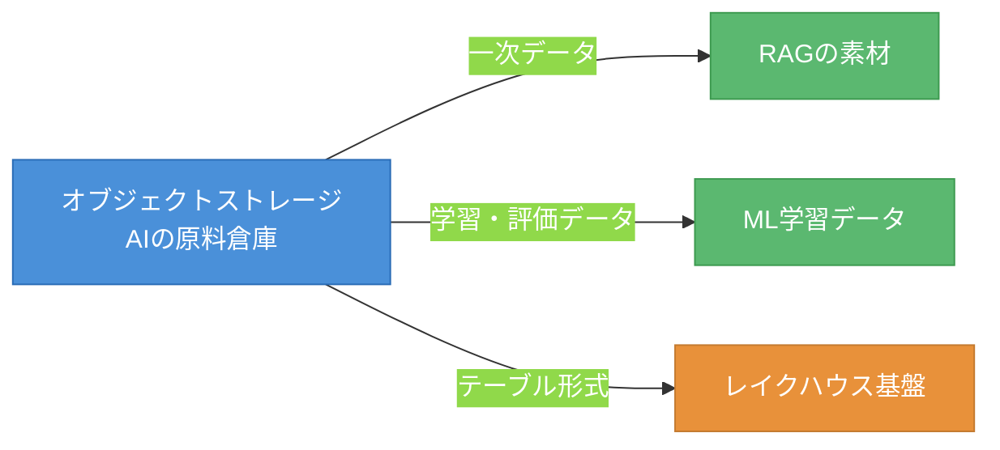
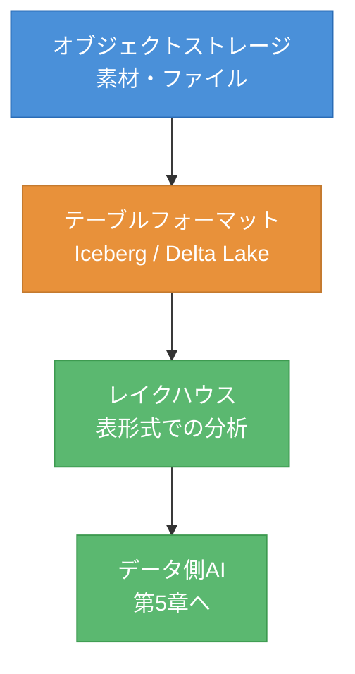
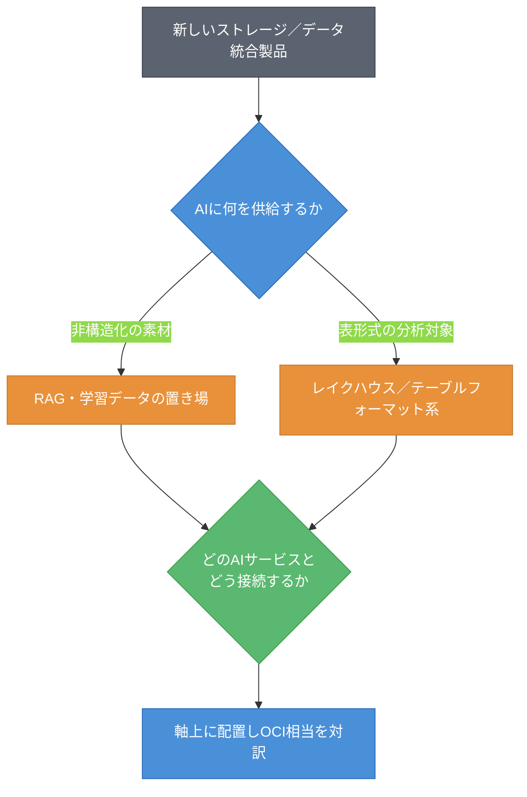

# 第3章 オブジェクトストレージ ― RAGの一次データ置き場とレイクハウス接続

第2章では、実行基盤がAIアプリ／エージェントのホストにすぎず、Kubernetesという共通仕様の上で各社のギャップが小さいことを見た。本章では、そのホストが扱うデータの一次置き場、すなわちオブジェクトストレージへと地図を進める。AIワークロード、とりわけRAG（Retrieval-Augmented Generation、検索拡張生成）の素材は、まずここに置かれる。本章を読み終えると、4社のオブジェクトストレージを「AIの素材をどう供給するか」という軸の上に置き、RAGとレイクハウスへの接続点として理解できるようになる。

## 3.1 軸の導入 ― ストレージを「AIの素材供給源」として切る

オブジェクトストレージ（Object Storage）は、容量・耐久性・コストといった一般的な軸でも語れる。しかし本書はAIワークロードの地図を描くため、別の軸で切る。「AIの素材をどう供給するか」である。図3.1にこの役割を示す。

図3.1: オブジェクトストレージのAIワークロードにおける役割

この軸で見ると、オブジェクトストレージはAIの「原料倉庫」である。RAGの一次データ（社内ドキュメント、PDF、画像など）の置き場になる。機械学習の学習・評価データの置き場にもなる。さらにテーブルフォーマットを通じてレイクハウスの基盤にもなる。容量や耐久性は前提条件にすぎず、AIワークロードにとって本質的なのは「どんな素材を、どうAIに供給するか」である。

この視点を取ると、4社の基本機能の差はほとんど問題にならない。差が問題になるのは、ストレージがAIサービスやデータ基盤とどれだけなめらかに接続するか、という統合の度合いである。

## 3.2 4社プロット ― S3・Blob・GCS・OCI Object Storage

軸ができたので、4社の製品を並べる。表3.1に4社プロットを示す。

表3.1: オブジェクトストレージの4社プロット（確認日 2026-06-09）

| 観点 | AWS | Azure | Google Cloud | OCI（原点） |
|------|-----|-------|--------------|------|
| 製品名 | Amazon S3 | Azure Blob Storage | Google Cloud Storage（GCS） | OCI Object Storage |
| ストレージ階層 | S3 Standard / IA / Glacier 等 | Hot / Cool / Cold / Archive | Standard / Nearline / Coldline / Archive | Standard / Infrequent Access / Archive |
| イベント連携 | S3 Event Notifications | Event Grid 連携 | Pub/Sub 通知 | Events サービス連携 |
| データ統合・分析 | Glue / Athena / Lake Formation 等 | Fabric / Synapse 連携 | BigQuery / Knowledge Catalog（旧 Dataplex）連携[^2] | Autonomous Database / Data Catalog 連携 |

基本機能（オブジェクトの格納、ストレージ階層、署名付きURL、イベント通知）はほぼ横並びである。どの社も耐久性の高いオブジェクトストレージを持ち、複数のストレージ階層でコストを最適化できる。

差が現れるのは最下行の「データ統合・分析」である。各社は自社の分析・データ基盤サービスとストレージを密に統合しており、その作り込みとエコシステムの広さに違いがある。AWSは Glue・Athena・Lake Formation を中心とした広いデータエコシステムを持つ。OCIは Autonomous Database との近接が特徴で、これは第5章のデータ側AIに直結する。

## 3.3 対訳（他社→OCI）

代表製品のOCI相当を対訳記号で示す。表3.2に対訳表を示す。

表3.2: オブジェクトストレージ対訳表（他社→OCI、確認日 2026-06-09）

| 他社の機能 | OCI相当 | 記号 | 注記 |
|-----------|---------|------|------|
| Amazon S3（基本機能） | OCI Object Storage | ≒ | オブジェクトストレージとして対応 |
| S3 署名付きURL | 事前認証リクエスト（PAR） | ≒ | 名称は異なるが同じ役割 |
| S3 Event Notifications | OCI Events 連携 | ≒ | オブジェクト操作のイベント連携 |
| S3 Access Points | （明確な単一相当なし） | △ | アクセス制御の構造が異なる。要確認 |
| S3 互換API | OCI Object Storage の S3 互換API | ≒ | 既存ツールの相互運用に有効 |

中核となるオブジェクトストレージ機能は ≒ で対応する。署名付きURLはOCIでは事前認証リクエスト（Pre-Authenticated Request、PAR）という名前だが、役割は同じである。S3互換APIの存在は、既存のS3向けツールをOCIで使ううえで重要である。一方、S3 Access Points のようなアクセス制御の構造には △ が付く。アクセス制御の組み立て方が各社で異なるためである。

## 3.4 RAGとレイクハウスへの接続

オブジェクトストレージがAIワークロードで果たす役割を、2つの接続点で具体化する。RAGの一次データ置き場としての役割と、レイクハウスへの接続である。まず図3.2にRAGパイプラインにおけるストレージの位置を示す。

```mermaid
%%{init: {'theme': 'base', 'themeVariables': {'primaryColor': '#4A90D9', 'primaryTextColor': '#FFFFFF', 'primaryBorderColor': '#2A6CB6', 'lineColor': '#333333', 'textColor': '#1A1A1A', 'background': 'transparent'}}}%%
flowchart LR
    DOC[一次データ<br/>PDF・文書・画像]:::user --> OS[オブジェクトストレージ]:::main
    OS --> CH[チャンク分割]:::sub
    CH --> EM[埋め込み生成]:::sub
    EM --> VS[ベクトルストア]:::tool
    VS --> RET[検索・取得]:::tool
    RET --> GEN[LLMによる生成]:::main

    classDef main fill:#4A90D9,stroke:#2A6CB6,color:#FFFFFF
    classDef sub fill:#E8913A,stroke:#C47A2F,color:#FFFFFF
    classDef tool fill:#5BB870,stroke:#3D9A50,color:#FFFFFF
    classDef user fill:#5C6370,stroke:#3D4450,color:#FFFFFF
```

図3.2: RAGパイプラインにおけるオブジェクトストレージの位置

RAGの起点はオブジェクトストレージである。一次データ（PDF、文書、画像）をまずストレージに置き、そこからチャンク分割・埋め込み生成を経てベクトルストアに格納し、検索・取得を経てLLMの生成に与える。この一連の流れの最初の一歩が、ストレージへのデータ配置である。RAGの品質はこの素材の質と整理に大きく依存するため、ストレージは軽視できない。

次に、レイクハウスへの接続を見る。図3.3に、オブジェクトストレージとレイクハウスの接続を示す。

図3.3: オブジェクトストレージとレイクハウスの接続

オブジェクトストレージ上のファイルは、テーブルフォーマット（Table Format）を介して表形式のデータとして扱える。代表的なテーブルフォーマットが Apache Iceberg と Delta Lake である。これにより成立するのがレイクハウス（Lakehouse）である。レイクハウスは、ストレージという「原料倉庫」と、構造化された分析・AIの世界をつなぐ橋になる。この橋は第5章のデータ側AIに直結する。テーブルフォーマットは、AIとデータ基盤を結ぶ要の技術である。

## 3.5 両方向ギャップとSWOTスライス

この領域の両方向ギャップとSWOTスライスを表3.3にまとめる。OCIの弱みを必ず含める。

表3.3: オブジェクトストレージの両方向ギャップとSWOTスライス（確認日 2026-06-09）

| 観点 | 内容 |
|------|------|
| 他社にありOCIにない | S3を中心としたデータ・分析エコシステムとサードパーティ統合が相対的に広い傾向[^1]（定量的な優劣は要確認） |
| OCIにあり他社にない | Autonomous Database（自律運用DB）とストレージの近接による、データ側AIへのなめらかな接続[^3]（他社も自社DB／DWHとの近接は持つため、固有性は自律運用DBとの統合という点に限られる） |
| AWS（強み/弱み） | S: S3のデファクト的地位[^1]、広いエコシステム。W: 機能・サービスが多く全体把握が難しい |
| Azure（強み/弱み） | S: Fabric 等の分析統合、Microsoft製品群との連携。W: 階層・命名がやや複雑 |
| Google Cloud（強み/弱み） | S: BigQuery との強い統合、データ分析の完成度。W: エコシステムがGoogle中心 |
| OCI（強み/弱み） | S: S3互換API、Autonomous Database近接、価格性能。**W: サードパーティ統合・データエコシステムの広さで他社に見劣りしうる** |

基本機能は横並びだが、ストレージを取り巻くデータ・分析エコシステムの広さには差がある。S3はデファクト的な地位を持ち、その傍証として各社がS3互換APIを提供している[^1]。OCIはS3互換APIと Autonomous Database への近接に強みを持つ一方、サードパーティ統合の広さでは追う立場になりうる。これを隠さず記す。

## 3.6 新顔の分類手順と確認日

未知のストレージ／データ統合製品を地図に置く手順を示す。図3.4にフローチャートを示す。

図3.4: ストレージ系新製品の分類フロー

手順は二段階である。まず「AIに何を供給するか」を判定する。非構造化の素材ならRAG・学習データの置き場、表形式の分析対象ならレイクハウス／テーブルフォーマット系に分類する。次に「どのAIサービスとどう接続するか」を確認し、軸上に置いてOCI相当を対訳する。ストレージ系の新製品は「AIに何をどう供給するか」で位置づけられる。

本章では、オブジェクトストレージをAIの素材供給源として捉え、RAGの起点でありレイクハウスへの橋であることを見た。基本機能は横並びで、差はデータエコシステムの広さに現れる。次の章では、その素材を使う本丸、すなわちマネージドAI（基盤モデル・RAG・エージェント）へと地図を進める。素材から、それを使うAIへと移る。

## 理解度チェック

### Q1. ストレージを切る軸

**種類**: 概念の確認

**難易度**: 基礎

**問題文**:
本書がオブジェクトストレージを「容量・耐久性」ではなく「AIの素材供給源」という軸で切る意図を説明せよ。

解答と解説

**解答**: 本書はAIワークロードの地図を描くことが目的である。容量・耐久性の観点では4社の基本機能はほぼ横並びで差が見えにくい。「AIに何をどう供給するか」という軸で切ると、ストレージがRAGの起点・学習データ置き場・レイクハウス基盤として果たす役割が見え、AIサービスやデータ基盤との統合の度合いという本質的な差が浮かび上がるため。

**解説**: 軸の選び方が、見える差を決める。AIワークロードの視点では、ストレージ単体機能より統合の度合いが重要になる。

**関連する節**: 3.1、3.5

---

### Q2. RAGにおけるストレージの役割

**種類**: 概念の確認

**難易度**: 基礎

**問題文**:
RAGパイプラインにおいて、オブジェクトストレージが担う役割を、パイプラインのどの位置にあるかを含めて説明せよ。

解答と解説

**解答**: オブジェクトストレージはRAGパイプラインの起点に位置する。一次データ（PDF、文書、画像）をまず格納し、そこからチャンク分割・埋め込み生成を経てベクトルストアに格納され、検索・取得を経てLLMの生成に与えられる。RAGの品質は素材の質と整理に依存するため、起点であるストレージは重要である。

**解説**: RAGは「検索して生成する」手法であり、検索対象の素材を最初に置く場所がオブジェクトストレージである。第4章のマネージドRAG、第5章のDB内ベクトルともつながる。

**関連する節**: 3.4

---

### Q3. ドキュメント検索基盤の設計

**種類**: 設計問題

**難易度**: 応用

**問題文**:
あるAI案件で、社内文書に対するドキュメント検索基盤を設計する。一次データ置き場とレイクハウスへの接続を、本章の軸に沿ってどう構成するか。考え方を述べよ。

解答と解説

**解答**: (1) 非構造化の社内文書（PDF・文書・画像）は、まずオブジェクトストレージに一次データとして置く。これがRAGの起点となる（図3.2）。(2) そこからチャンク分割・埋め込み生成を経てベクトルストアに入れ、検索・生成のパイプラインを構成する。(3) 文書のメタデータや構造化された業務データを横断分析したい場合は、テーブルフォーマット（Iceberg / Delta Lake）を介してレイクハウスに接続し、データ側AI（第5章）へつなぐ。(4) どのAIサービスと接続するかに応じて、ストレージの統合機能（イベント連携・互換API）を選ぶ。

**解説**: 本章の軸「AIに何をどう供給するか」に沿うと、非構造化素材はRAG経路、表形式の分析対象はレイクハウス経路に分けて設計できる。両経路の起点がオブジェクトストレージである。

**関連する節**: 3.4、3.6

---

### Q4. 一次データ置き場の選択

**種類**: 判断問題

**難易度**: 応用

**問題文**:
ある案件で、既存のS3向けツール群をそのまま使いつつ、データの一次置き場を別クラウド（OCIを想定）のオブジェクトストレージに置きたい。移行・相互運用の観点から、どの機能の有無を判断基準にすべきか。

**選択肢**:
- (a) ストレージ階層の数
- (b) S3互換API（S3 Compatibility API）の有無
- (c) イベント連携の方式
- (d) 署名付きURLの名称

解答と解説

**解答**: (b) S3互換API（S3 Compatibility API）の有無

**解説**: 既存のS3向けツールをそのまま使うには、ストレージ側がS3互換APIを提供しているかが決定的である。OCI Object Storage はS3互換APIを持つため、既存ツールの相互運用に有効である（表3.2）。ストレージ階層数やイベント方式は移行可否を直接左右しない。署名付きURLはOCIでは事前認証リクエスト（PAR）という名称だが、名称の違いは判断基準にならない。

**関連する節**: 3.3、3.5

---

## 参考文献

- Amazon Web Services "Amazon S3 Documentation / Glue / Athena / Lake Formation" , https://docs.aws.amazon.com/s3/ （確認日: 2026-06-09）
- Microsoft "Azure Blob Storage documentation / Microsoft Fabric" , https://learn.microsoft.com/en-us/azure/storage/blobs/ （確認日: 2026-06-09）
- Google "Cloud Storage documentation / BigQuery / Knowledge Catalog" , https://docs.cloud.google.com/storage/docs （確認日: 2026-06-09）
- Oracle "Object Storage documentation / Pre-Authenticated Requests / S3 Compatibility API / Data Catalog" , https://docs.oracle.com/en-us/iaas/Content/Object/Concepts/objectstorageoverview.htm （確認日: 2026-06-09）
- Oracle "Object Storage Amazon S3 Compatibility API" , https://docs.oracle.com/en-us/iaas/Content/Object/Tasks/s3compatibleapi.htm （確認日: 2026-06-09）
- The Apache Software Foundation "Apache Iceberg" , https://iceberg.apache.org/ （確認日: 2026-06-09）
- Delta Lake "Delta Lake Documentation" , https://delta.io/ （確認日: 2026-06-09）

[^1]: S3のデファクト的な地位は、競合各社（Azure / Google Cloud / OCI）が自社ストレージにS3互換APIを提供している事実に表れる。OCIのS3互換APIは https://docs.oracle.com/en-us/iaas/Content/Object/Tasks/s3compatibleapi.htm を参照。市場シェア等の定量的な優劣は本書では断定しない（確認日: 2026-06-09）。

[^2]: Google の Dataplex は2026-04-10に改称された（Dataplex Universal Catalog→Knowledge Catalog 等）。基準日2026-06-09時点の名称は Knowledge Catalog である。https://docs.cloud.google.com/dataplex/docs/release-notes （確認日: 2026-06-09）。

[^3]: OCI Autonomous Database と Object Storage / Data Catalog の統合による近接を指す。他社も自社DB／データウェアハウス（Redshift、Synapse／Fabric、BigQuery 等）とストレージの統合を持つため、「他社にない」固有性は自律運用DB（Autonomous Database）との統合という限定された点にある（確認日: 2026-06-09、要確認）。

## 確認日

- 本章の基準日: 2026-06-09
- 特に陳腐化しやすい項目: 各社のストレージ階層の名称、データ統合・分析サービス名（Fabric、Knowledge Catalog〔旧 Dataplex〕等）、Oracleの"Autonomous AI Database"へのブランド更新、S3 Access Points 相当の有無。次回更新時に各社公式ドキュメントで再確認すること。
