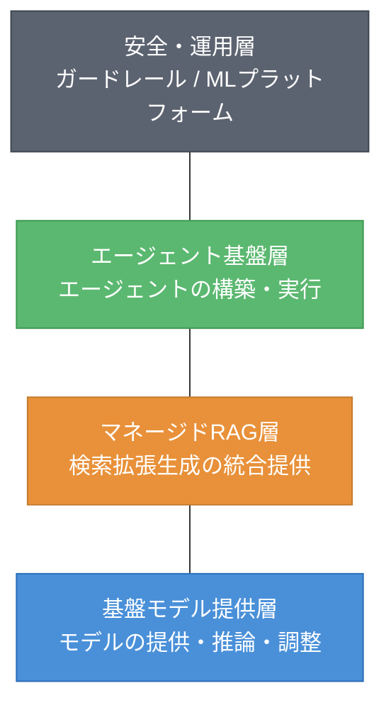
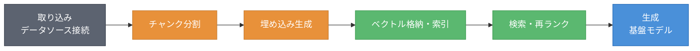
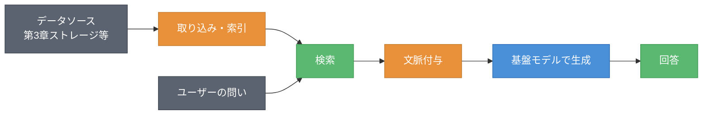
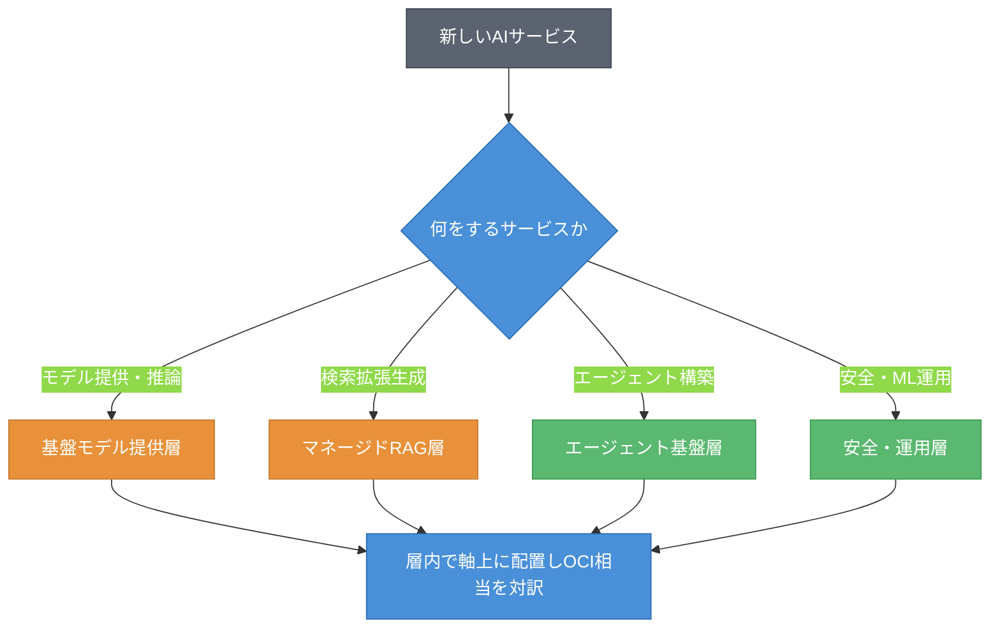

# 第4章 マネージドAI ― 基盤モデル・エージェント基盤・マネージドRAG・ガードレール

第3章では、オブジェクトストレージがAIの素材供給源であり、RAGの起点であることを見た。本章では、その素材を使う本丸、すなわちマネージドAIへと地図を進める。マネージドAIは本書の重心の一つである。同時に、製品名・モデル数・提供状態の陳腐化が特に速い領域でもある。だからこそ、製品ではなく層（軸）で捉えることが効いてくる。本章を読み終えると、4社のマネージドAIを「モデル提供・RAG・エージェント・安全/運用」という4つの層に分けて置けるようになる。新しいAIサービスが現れても、それが4層のどこに属するかを判断できるようになる。

## 4.1 軸の導入 ― マネージドAIを4層で切る

マネージドAIは製品が多く、毎月のように増える。これを「基盤モデル（Foundation Model）の数」や「最新モデルの有無」で追いかけると、短期間で陳腐化する。本書は代わりに、マネージドAIを4つの層で切る。図4.1にこの4層モデルを示す。



図4.1: マネージドAIの4層モデル（軸）

最下層は基盤モデル提供層である。基盤モデルを提供し、推論を実行し、必要に応じてファインチューニングなどの調整を行う。その上にマネージドRAG層がある。検索拡張生成の構成要素を事業者が統合して提供する層である。さらにその上にエージェント基盤層があり、AIエージェントの構築・実行を支える。最上層は安全・運用層で、ガードレール（Guardrails）やMLプラットフォームが属する。

この4層は、製品が入れ替わっても残る。新しいAIサービスに出会ったら、まず「これは4層のどこに属するか」を考えればよい。モデルを提供するなら最下層、エージェントを組むなら第3層、というように。以降の節では、層ごとに4社をプロットしていく。

## 4.2 4社プロット ― 基盤モデル提供層

まず最下層、基盤モデル提供層を見る。表4.1に4社プロットを示す。製品名・モデルの品揃えはスナップショットであり、確認日（2026-06-09）時点のものである。

表4.1: 基盤モデル提供層の4社プロット（確認日 2026-06-09）

| 観点 | AWS | Azure | Google Cloud | OCI（原点） |
|------|-----|-------|--------------|------|
| 基盤モデル提供 | Amazon Bedrock | Microsoft Foundry | Gemini Enterprise Agent Platform（旧 Vertex AI）[^3] | OCI Generative AI |
| モデルの調達方針 | 複数ベンダーのモデルを提供 | OpenAI ＋ Anthropic 等の多様なモデル | Gemini ＋ パートナーモデル | 複数ベンダーのモデルを提供 |
| ファインチューニング | 対応（モデルによる） | 対応 | 対応 | 対応（モデルによる） |

4社とも、複数の基盤モデルをマネージドに提供する点は共通する。違いはモデルの品揃えと調達方針にある。Google Cloud は自社の Gemini を軸に据える。Azure は OpenAI のモデルとの関係が深く、近年は Anthropic 等も加えてマルチモデル化が進む。AWS と OCI は複数ベンダーのモデルを取りそろえる方針を取る。なお、この層は事業者のブランド改称が相次ぐ。Azure は Microsoft Foundry へ、Google Cloud は Gemini Enterprise Agent Platform へと名称を変えており、名称は陳腐化しやすい[^1][^3]。モデルの数や最新モデルの有無は確認日付きで扱い、本書は軸（モデルを提供する層という役割）を覚えることを勧める。

## 4.3 マネージドRAG層のプロットと対訳

第2層、マネージドRAG層に進む。マネージドRAG（Managed RAG）は、検索拡張生成の構成要素を事業者が統合して提供する。まず構成要素を分解する。図4.2にマネージドRAGの構成要素を示す。



図4.2: マネージドRAGの構成要素分解

マネージドRAGは、取り込み・チャンク分割・埋め込み生成・ベクトル格納/索引・検索/再ランク・生成という構成要素からなる。事業者はこれらを統合し、利用者が個々の部品を組まずに使えるようにする。この構成要素の分解が、4社を比較する物差しになる。表4.2に対訳を示す。

表4.2: マネージドRAG層の対訳表（他社→OCI、確認日 2026-06-09）

| 他社のマネージドRAG | OCI相当 | 記号 | 注記 |
|---------------------|---------|------|------|
| Amazon Bedrock Knowledge Bases | OCI Generative AI Agents のRAG機能 | △ | OCIもマネージドRAGを提供（存在は確定）。構成要素の作り込み・コネクタ範囲に差。詳細は要確認 |
| Microsoft Foundry の検索統合（Azure AI Search） | 同上 | △ | 同上 |
| Vertex AI Search（RAG用途、現 Gemini Enterprise 配下） | 同上 | △ | 同上 |

マネージドRAGは各社とも提供するが、構成要素の作り込み（取り込みのコネクタ、再ランクの方式、ベクトルストアの選択肢）に差がある。この層は陳腐化が速いため、対訳には △ と「要確認」を多く付す。重要なのは、どの社のマネージドRAGも図4.2の構成要素に分解して比較できるという点である。なお、データの「中」でRAGを行う方式（DB内ベクトル）は第5章で扱う。

## 4.4 エージェント基盤層のプロットと対訳

第3層、エージェント基盤層に進む。エージェント基盤（Agent Platform）は、AIエージェントの構築・実行を支える。この層では、各社のエージェント基盤に加えて、MCP（Model Context Protocol、モデルと外部ツール・データを接続する標準プロトコル）への対応が論点になる。表4.3に4社プロットとMCP対応を示す。

表4.3: エージェント基盤層の4社プロットとMCP対応（確認日 2026-06-09）

| 観点 | AWS | Azure | Google Cloud | OCI（原点） |
|------|-----|-------|--------------|------|
| エージェント基盤 | Amazon Bedrock AgentCore | Microsoft Foundry Agent Service | Vertex AI Agent Builder（Agent Engine / ADK） | OCI Generative AI Agents |
| MCP対応 | 対応済み | 対応済み | 対応済み | 対応済み（MCP Calling） |

エージェント基盤は陳腐化が特に速い領域である。各社が頻繁に機能を追加・改称するため、製品名は確認日付きで扱う。一方、MCPのような共通プロトコルは、特定の事業者に依存しない横串として効く。MCPに対応していれば、エージェントは事業者をまたいでツールやデータに接続しやすくなる。基準日2026-06-09時点では、4社ともMCPに対応済みである[^2]。ただし対応範囲・成熟度は流動的なため、確認日での再確認を要する。第1章のエージェントIDは、この層のエージェントに身元を与える基盤として接続する。

## 4.5 安全・運用層 ― ガードレールとMLプラットフォーム

最上層、安全・運用層を見る。この層にはガードレールとMLプラットフォーム（ML Platform）が属する。表4.4に対訳を示す。

表4.4: ガードレール・MLプラットフォームの対訳表（他社→OCI、確認日 2026-06-09）

| 他社の機能 | OCI相当 | 記号 | 注記 |
|-----------|---------|------|------|
| Amazon Bedrock Guardrails | OCI のコンテンツ安全機構 | △ | 入出力の制御として対応。粒度・設定に差。要確認 |
| Amazon SageMaker（現 Amazon SageMaker AI） | OCI Data Science | ≒ | ML開発・運用基盤として対応 |
| Azure Machine Learning | OCI Data Science | ≒ | 同上 |
| Vertex AI のML基盤（現 Gemini Enterprise 配下） | OCI Data Science | ≒ | 同上 |

ガードレールは生成AIの入出力を制御・制限する安全機構である。各社で対応の粒度（有害表現のフィルタ、トピック制限、個人情報のマスキングなど）が異なるため、対訳には △ を付す。リスト4.1に、ガードレール設定の概念例を示す。

**リスト4.1: ガードレール設定の概念例（疑似コード・JSON）**

```json
{
  "guardrail": {
    "blockedTopics": ["金融助言", "医療診断"],
    "piiMasking": ["メールアドレス", "電話番号"],
    "contentFilter": {
      "hate": "high",
      "violence": "high"
    }
  }
}
```

MLプラットフォームは、機械学習モデルの開発・運用を支える成熟した基盤である。各社のML基盤はいずれも OCI Data Science に ≒ で対応する。生成AI以前からある領域であり、横並びに近い。

## 4.6 ケイパビリティ・カード ― マネージドRAGの一貫性

マネージドRAGで論点が立つのは「取り込みから生成まで、どこまで一貫して事業者が面倒を見るか」である。これをカード化する。

### ケイパビリティ・カード: マネージドRAGの一貫性

- **課題**: RAGは取り込み・チャンク・埋め込み・検索・生成という多数の部品からなる。これらを自前で組むと運用が重い。一方で、事業者が一貫提供すると、部品の選択自由度は下がる。一貫性と自由度のどちらを取るか。
- **OCIでの実現**: OCI Generative AI Agents のRAG機能で、取り込みから生成までを統合的に提供する。データ近接（第5章のDB内ベクトル）と組み合わせる選択肢もある。要確認。
- **他社での実現**: AWS は Bedrock Knowledge Bases で一貫提供する。Azure は Microsoft Foundry の検索統合、Google Cloud は Vertex AI Search を用いる。いずれも一貫提供と部品選択のバランスが製品ごとに異なる。
- **差分の見立て**: 一貫性の高さはどの社も向上させており、横並びに近づいている。差が出るのは、データの「中」でRAGを行うDB内ベクトル（第5章）との接続のなめらかさである。ここはOCIの強みが出やすいが、断定は第5章で出典とともに行う。
- **確認日**: 2026-06-09

図4.3に、マネージドRAGのend-to-end構成を示す。これは4社を対比する際の共通の骨格になる。



図4.3: マネージドRAGのend-to-end構成（4社対比の共通骨格）

## 4.7 両方向ギャップとSWOTスライス

この領域の両方向ギャップとSWOTスライスを表4.5にまとめる。OCIの弱みを必ず含める。

表4.5: マネージドAIの両方向ギャップとSWOTスライス（確認日 2026-06-09）

| 観点 | 内容 |
|------|------|
| 他社にありOCIにない | 基盤モデルの品揃えの幅、エージェント・RAGの周辺機能の厚み、サードパーティ・エコシステムの広さが相対的に厚い傾向（各社モデルカタログ等で確認可能。定量的優劣は要確認） |
| OCIにあり他社にない（設計の重心の差） | データ側AI（第5章）との近接を設計の重心に据えたマネージドAI（他社もDB内ベクトル等の近接手段は持つため、排他ではなく重心の置き方の差。詳細な対比と出典は第5章で示す） |
| AWS（強み/弱み） | S: 複数ベンダーモデルの品揃え、Bedrock周辺の厚み。W: 構成要素が多く選択が複雑 |
| Azure（強み/弱み） | S: OpenAIモデルとの関係、エンタープライズ浸透。W: ブランド改称が多く追従が必要 |
| Google Cloud（強み/弱み） | S: Gemini と検索・データ基盤の統合。W: エコシステムがGoogle中心 |
| OCI（強み/弱み） | S: データ近接、価格性能。**W: 基盤モデルの品揃え・エージェント周辺機能・エコシステムで他社に見劣りしうる** |

マネージドAIは各社の競争が特に激しい領域である。基盤モデルの品揃えやエージェント周辺機能の厚みでは、先行する他社が有利な面がある。OCIはデータ側AIとの近接と価格性能に強みを持つ一方、品揃えとエコシステムでは追う立場になりうる。これを隠さず記す。なお、絶対的な規模や品揃えの優劣は時期により変動するため、断定は確認日付きで扱う。

## 4.8 新顔の分類手順と確認日

未知のAIサービスを地図に置く手順を示す。図4.4にフローチャートを示す。



図4.4: マネージドAI新製品の分類フロー（4層への振り分け）

手順は二段階である。まず「何をするサービスか」で4層のどこに属するかを決める。モデルを提供するなら基盤モデル提供層、検索拡張生成ならマネージドRAG層、エージェントを組むならエージェント基盤層、安全やML運用なら安全・運用層である。次に、その層の中で軸上に置き、OCI相当を対訳する。層を決めてから軸上に置く、この二段階で新製品も整理できる。

本章では、マネージドAI（アプリ側AI）を4層で捉え、4社をプロットした。基盤モデル・RAG・エージェント・安全運用のいずれも、製品は陳腐化するが層という軸は残る。だが、AIはアプリ側だけではない。データの「中」で動くAIがある。次の章では、データ側AI（DB組み込み）へと地図を進める。これはOracleの主戦場であり、読者のデータ領域のギャップを埋める章でもある。アプリ側AIから、データ側AIへと移る。

## 理解度チェック

### Q1. マネージドAIの4層モデル

**種類**: 概念の確認

**難易度**: 基礎

**問題文**:
本書がマネージドAIを切る4つの層を挙げ、それぞれの役割を簡潔に説明せよ。

<details>
<summary>解答と解説</summary>

**解答**: (1) 基盤モデル提供層: 基盤モデルを提供し推論・調整を行う。(2) マネージドRAG層: 検索拡張生成の構成要素を統合提供する。(3) エージェント基盤層: AIエージェントの構築・実行を支える。(4) 安全・運用層: ガードレールやMLプラットフォームが属する。

**解説**: 製品やモデル数は陳腐化するが、4層という軸は残る。新製品もまず「4層のどこに属するか」で整理できる。

**関連する節**: 4.1、4.8

</details>

---

### Q2. Bedrock Knowledge Bases の対訳

**種類**: 判断問題

**難易度**: 応用

**問題文**:
Amazon Bedrock Knowledge Bases は、本書の4層のどの層に属し、OCIの何に相当するか。対訳記号付きで答えよ。

**選択肢**:
- (a) 基盤モデル提供層 / OCI Generative AI（≒）
- (b) マネージドRAG層 / OCI Generative AI Agents のRAG機能（△）
- (c) エージェント基盤層 / OCI Data Science（≒）
- (d) 安全・運用層 / 相当なし

<details>
<summary>解答と解説</summary>

**解答**: (b) マネージドRAG層 / OCI Generative AI Agents のRAG機能（△）

**解説**: Bedrock Knowledge Bases は検索拡張生成を統合提供するマネージドRAGであり、第2層に属する。OCIでは OCI Generative AI Agents のRAG機能が対応するが、構成要素の作り込みに差があり提供状態も流動的なため △ とする。

**関連する節**: 4.3

</details>

---

### Q3. MCPが横串として効く理由

**種類**: 概念の確認

**難易度**: 応用

**問題文**:
MCP（Model Context Protocol）が、特定の事業者に依存しない「横串」として効くのはなぜか。エージェント基盤層の観点から説明せよ。

<details>
<summary>解答と解説</summary>

**解答**: MCPはモデルと外部ツール・データを接続する標準プロトコルである。エージェントがMCPに対応していれば、事業者ごとの独自仕様に縛られず、事業者をまたいでツールやデータに接続できる。このため、特定のエージェント基盤に閉じない共通層として、4社いずれの上でも効く。

**解説**: 製品（エージェント基盤）は陳腐化が速いが、共通プロトコルは事業者を問わず使える。ロックインを避ける観点でも重要である。各社の対応状況は流動的なため確認日で再確認する。

**関連する節**: 4.4

</details>

---

### Q4. 新しいマネージドエージェントサービスの分類

**種類**: 設計問題

**難易度**: 応用

**問題文**:
ある事業者が「データソースに接続し、ツールを呼び出して自律的にタスクを実行するマネージドサービス」を発表した。本章の分類フロー（4.8）に沿って、このサービスを地図のどこに置くか設計せよ。

<details>
<summary>解答と解説</summary>

**解答**: (1) まず「何をするサービスか」を判定する。自律的にタスクを実行しツールを呼ぶので、エージェント基盤層（第3層）に属する。(2) その層の中で、MCP対応・データソース接続・ツール呼び出しといった軸上の位置を確認する。(3) OCI相当（OCI Generative AI Agents）を対訳記号で対応づける。エージェント領域は陳腐化が速いため △ や要確認になりやすい。(4) 第1章のエージェントIDが、このエージェントに身元を与える基盤として接続する。(5) 確認日を付してスナップショットとして記録する。

**解説**: 層を決めてから軸上に置く二段階が要点である。エージェント基盤層は最も流動的なので、確認日とスナップショットの扱いが特に重要になる。

**関連する節**: 4.4、4.8

</details>

---

### Q5. マネージドRAGを構成要素に分解する利点

**種類**: 概念の確認

**難易度**: 応用

**問題文**:
本章はマネージドRAGを「取り込み・チャンク分割・埋め込み生成・ベクトル格納/索引・検索/再ランク・生成」という構成要素に分解した（図4.2）。製品名で比較せず、この構成要素で4社を比較することの利点を説明せよ。

<details>
<summary>解答と解説</summary>

**解答**: マネージドRAGの製品名や提供状態は陳腐化が速く、製品単位の比較はすぐに古くなる。一方、構成要素（取り込み・チャンク・埋め込み・索引・検索・生成）は不変の物差しであり、各社のマネージドRAGをこの物差しに当てれば、「どの構成要素の作り込みに差があるか（コネクタの範囲、再ランク方式、ベクトルストアの選択肢など）」を一貫して比較できる。新しいマネージドRAG製品が出ても同じ物差しで評価でき、賞味期限のない比較ができる。

**解説**: これは本書の方法論「製品ではなく軸（ここでは構成要素）で捉える」をマネージドRAGに適用したものである。構成要素という軸は、製品が入れ替わっても残る。

**関連する節**: 4.3、4.6

</details>

---

## 参考文献

- Amazon Web Services "Amazon Bedrock / Bedrock Knowledge Bases / Bedrock Guardrails / AgentCore / SageMaker Documentation" , https://docs.aws.amazon.com/bedrock/ （確認日: 2026-06-09）
- Microsoft "Microsoft Foundry documentation" , https://learn.microsoft.com/azure/foundry/ （確認日: 2026-06-09）
- Google "Gemini Enterprise Agent Platform（旧 Vertex AI）documentation" , https://cloud.google.com/products/gemini-enterprise-agent-platform （確認日: 2026-06-09）
- Oracle "OCI Generative AI / Generative AI Agents / Data Science / MCP Calling Documentation" , https://docs.oracle.com/en-us/iaas/Content/generative-ai/ （確認日: 2026-06-09）
- Model Context Protocol "Specification" , https://modelcontextprotocol.io/ （確認日: 2026-06-09）

[^1]: Azure の基盤モデル基盤は Azure AI Studio → Azure AI Foundry → Microsoft Foundry とブランド改称を重ねた。基準日2026-06-09時点の正式名称は Microsoft Foundry である（2026年1月の Microsoft Product Terms で Azure AI Foundry から正式改称）。改称頻度が高い領域のため次回更新時に再確認すること（確認日: 2026-06-09）。

[^2]: MCP（Model Context Protocol）は、モデルと外部ツール・データを接続するための標準プロトコルである（https://modelcontextprotocol.io/）。基準日2026-06-09時点で4社ともMCPに対応済みである（AWS: Bedrock AgentCore Runtime、Azure: Microsoft Foundry Agent Service、Google: ADK / MCP Toolbox、OCI: OCI Generative AI の MCP Calling、https://docs.oracle.com/en-us/iaas/Content/generative-ai/mcp.htm）。対応範囲・成熟度は流動的なため再確認を要する（確認日: 2026-06-09）。

[^3]: Google Cloud は2026-04-22（Cloud Next 26）に Vertex AI を Gemini Enterprise Agent Platform へ正式改称した（Agentspace を統合）。SDK・API は名称変更が中心で破壊的変更はなく、Vertex AI Search や Agent Builder 等の機能名は当面併用される。https://cloud.google.com/products/gemini-enterprise-agent-platform （確認日: 2026-06-09）。

## 確認日

- 本章の基準日: 2026-06-09
- 本章は陳腐化が特に速い領域である。特に陳腐化しやすい項目: 事業者の基盤・ブランド名（Azure→Microsoft Foundry、Google Cloud→Gemini Enterprise Agent Platform 等）、各社の基盤モデル品揃えとGA/プレビュー状態、マネージドRAG・エージェント基盤の機能名（Bedrock AgentCore、Vertex AI Agent Builder 等）、各社のMCP対応範囲。次回更新時に各社公式ドキュメントで必ず再確認すること。
