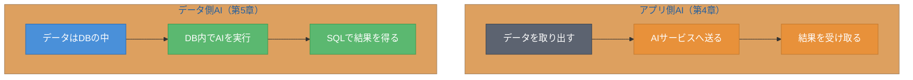
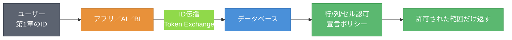
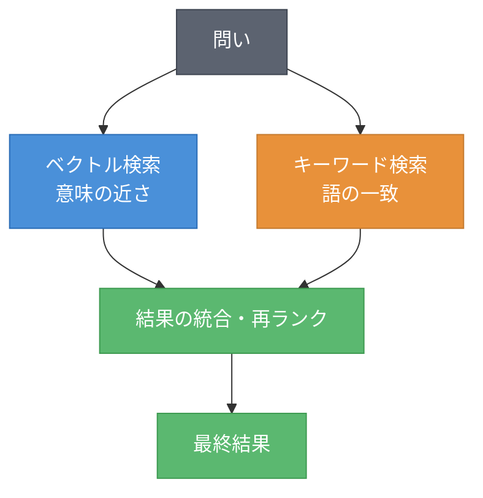
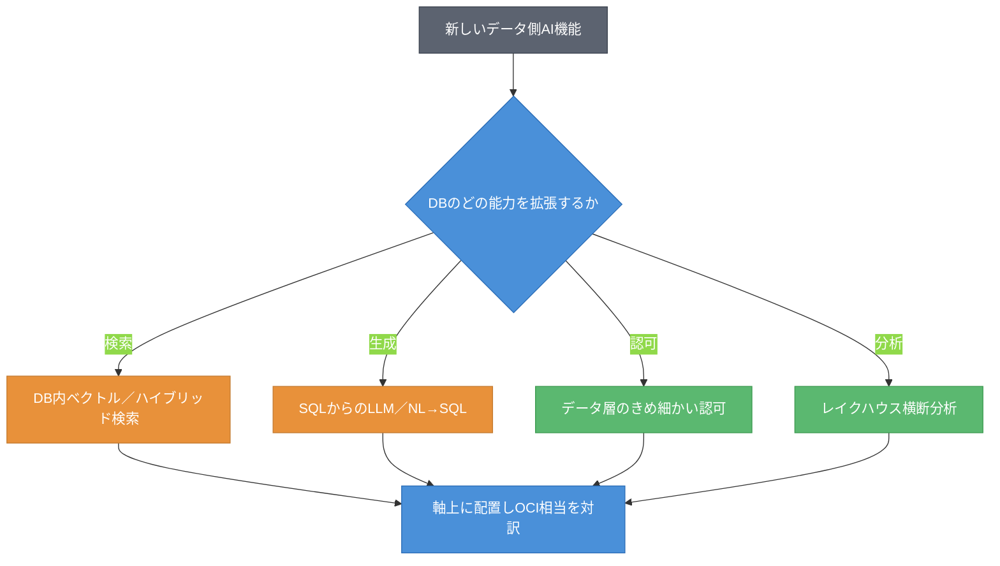

# 第5章 データ側AI（DB組み込み）― DB内ベクトル・Select AI・データ層認可

第4章では、マネージドAIを4層で捉え、アプリ側のAIを地図に並べた。しかしAIはアプリ側だけではない。データの「中」で動くAIがある。本章では、データ側AI（DB組み込み）へと地図を進める。これは本書の重心の一つであり、Oracleの強みの主戦場であると同時に、クラウドネイティブ基盤に強い読者がデータ領域に持つギャップを埋める章でもある。本章を読み終えると、DB内ベクトル・SQLからのLLM・データ層のきめ細かい認可・ハイブリッド検索という軸で4社を置けるようになる。さらに、第1章で見たID伝播がデータの奥まで貫通する筋道が見えるようになる。

## 5.1 軸の導入 ― AIを「データの中」で動かす軸

第4章のマネージドAIは、データをAIサービスに送って処理させる「アプリ側AI」だった。本章で扱うのは、その逆である。AIをデータの近く、あるいはデータベースの中に持ち込む「データ側AI」である。図5.1に両者の対比を示す。



図5.1: アプリ側AIとデータ側AIの対比

データ側AIの発想は、「データを動かさず、AIをデータに寄せる」ことである。これには3つの利点がある。データの移動が減ること、SQLという既存のインターフェースから使えること、そしてデータベースが持つきめ細かい認可をAIにも効かせられることである。本書はこの領域を4つの軸で切る。DB内ベクトル（In-Database Vector）、SQLからのLLM／NL→SQL（Natural Language to SQL）、データ層のきめ細かい認可、ハイブリッド検索（Hybrid Search）である。さらにレイクハウス横断のポリシーが加わる。これらはOracleが強みを持つ領域だが、本書は出典主義を貫き、誇張せずに対比する。

## 5.2 4社プロット ― DB内ベクトルとSQLからのLLM

まず、DB内ベクトルとSQLからのLLM呼び出し／NL→SQLを見る。表5.1に4社プロットを示す。製品名・バージョンはスナップショットである。

表5.1: DB内ベクトル・SQLからのLLMの4社プロット（確認日 2026-06-09）

| 観点 | AWS | Azure | Google Cloud | OCI（原点） |
|------|-----|-------|--------------|------|
| DB内ベクトル | Aurora / RDS PostgreSQL（pgvector）等 | Azure SQL / Cosmos DB のベクトル機能 | AlloyDB（pgvector / ScaNN）、BigQuery ベクトル | Oracle AI Vector Search（Oracle Database 23ai 以降） |
| SQLからのLLM／NL→SQL | Redshift ML、Bedrock 連携 | Azure SQL ＋ AIサービス連携 | BigQuery ML、Gemini in BigQuery | Select AI（Autonomous Database） |

各社ともDBにAI機能を取り込みつつある。PostgreSQL系では pgvector が広く使われ、AWS（Aurora）も Google Cloud（AlloyDB）もこれを取り込む。Oracle は Oracle AI Vector Search をデータベースに統合し、SQLからベクトル検索を行えるようにした[^1]。SQLからのLLM呼び出しとNL→SQLでは、Google Cloud の BigQuery ML や、Oracle の Select AI が代表的である。Select AI は自然言語の問いをSQLに変換し、またSQLからLLMを呼び出せる[^2]。リスト5.2にSelect AIの利用イメージを示す。

**リスト5.2: Select AI による自然言語からのSQL生成（疑似コード・SQL）**

```sql
-- 自然言語の問いをSQLに変換して実行する（概念例）
SELECT AI 先月の売上が最も多い地域はどこか;

-- SQLからLLMにテキスト生成を依頼する（概念例、chatアクション）
SELECT AI chat 在庫が少ない商品の補充メールの文面を作成して;
```

DB内ベクトルとSQLからのLLMは、各社とも整備が進む成長領域である。違いは「DBにどこまで深く統合され、SQLからどこまで一貫して使えるか」にある。

## 5.3 対訳（他社→OCI）

代表機能のOCI相当を対訳記号で示す。表5.2に対訳表を示す。Oracleのブランド（23ai／26ai／"Oracle AI Database"）は改称・拡張が進むため確認日付きで扱う。

表5.2: データ側AIの対訳表（他社→OCI、確認日 2026-06-09）

| 他社の機能 | OCI相当 | 記号 | 注記 |
|-----------|---------|------|------|
| Aurora / AlloyDB の pgvector | Oracle AI Vector Search | ≒ | DB内ベクトル検索として対応 |
| BigQuery ML（SQLからのML/LLM） | Select AI | ≒ | SQLからのLLM／NL→SQLとして対応 |
| Redshift ML | Select AI | △ | 用途は近いが基盤DBが異なる |
| 各社のRLS/CLS＋ID伝播 | Deep Data Security | △ | データ層認可の実現方式が異なる（5.4で詳述） |

DB内ベクトルとSQLからのLLMは ≒ で対応する成長領域である。一方、データ層のきめ細かい認可（Deep Data Security 相当）には △ が付く。実現方式が各社で大きく異なるためであり、ここがこの章で最も論点が立つ箇所である。次節でカード化する。

## 5.4 ケイパビリティ・カード ― データ層のきめ細かい認可

本章の核心は、データ層のきめ細かい認可である。第1章で見た委譲・ID伝播が、ここでデータの奥まで貫通する。

### ケイパビリティ・カード: データ層のきめ細かい認可

- **課題**: ユーザーに代わってAIやアプリがデータにアクセスするとき、「そのユーザーが見てよい行・列・セルだけ」を返したい。SQLを生成したのがBIツールでもAIでもアプリでも、生成元を問わず一貫して同じ認可を効かせたい。
- **OCIでの実現**: Deep Data Security により、データベースの中で行／列／セル単位の認可ポリシーを宣言的に定義する。SQLの生成元（人・BI・AI）を問わず一貫して適用される。Oracle AI Database 26ai に組み込まれ、確認日時点で一般提供されている[^3]。データベースが受け取ったユーザーの身元が、このポリシーの評価に使われる。第1章のID伝播（Token Exchange ＋ Identity Propagation Trust）は、その身元をデータ層まで運ぶ役割を担う。
- **他社での実現**: AWS は Trusted Identity Propagation でユーザーIDをデータサービスへ伝え、Lake Formation や各データサービスのRLS（Row-Level Security、行レベルセキュリティ）／CLS（Column-Level Security、列レベルセキュリティ）と組み合わせる。Azure・Google Cloud も、ID伝播と各データサービスのRLS/CLS・ポリシータグの組み合わせで近い目的を満たす。
- **差分の見立て**: 他社は「ID伝播＋各データサービスのRLS/CLS」の組み合わせで実現する。これに対しOCIは、認可をデータベースの中に宣言的に集約し、SQL生成元を問わず一貫適用する。この「集約と一貫性」がOCIの設計上の特徴である。ただし他社方式も同等の結果を実現できる場合が多く、優劣の断定は出典のある範囲に限る。
- **確認日**: 2026-06-09

図5.2に、データ層認可の貫通を示す。第1章のIDが、アプリ層を越えてデータの奥まで届く様子である。



図5.2: データ層認可の貫通（IDが下流のデータまで届く）

表5.3に、Deep Data Security と他社方式の対比を示す。

表5.3: Deep Data Security と他社方式の対比（確認日 2026-06-09）

| 観点 | OCI（Deep Data Security） | 他社（AWS / Azure / Google Cloud） |
|------|---------------------------|-----------------------------------|
| 認可の置き場 | データベースの中に宣言的に集約 | 各データサービスのRLS/CLS＋ID伝播の組み合わせ |
| 生成元への一貫性 | SQL生成元（人・BI・AI）を問わず一貫を志向 | サービスごとに設定。組み合わせで一貫性を担保 |
| ID伝播との接続 | DBが受け取ったユーザー身元を評価に使用（第1章のID伝播で運ばれる） | Trusted Identity Propagation 等で運んだ身元を使用 |

認可ポリシーの宣言イメージを、リスト5.1に示す。

**リスト5.1: 行／列レベル認可ポリシーの宣言（概念例・SQL）**

```sql
-- 行レベル：ユーザーの所属部門の行だけを見せる（概念例）
CREATE POLICY dept_rls ON sales
  USING (department = SYS_CONTEXT('USERENV', 'DEPARTMENT'));

-- 列レベル：給与列は人事ロールだけに見せる（概念例）
GRANT SELECT (name, department) ON employees TO analyst_role;
GRANT SELECT (name, department, salary) ON employees TO hr_role;
```

データ層認可は、第1章のID伝播と地続きである。IDを運ぶだけでは足りず、運んだ先で「行／列／セル」のどこまでを見せるかが決まって初めて、きめ細かい認可が完成する。

## 5.5 ハイブリッド検索とレイクハウス横断ポリシー

データ側AIの検索は、単一手法では足りない。ハイブリッド検索が要る。図5.3にその構成を示す。



図5.3: ハイブリッド検索の構成

ハイブリッド検索は、ベクトル検索（意味の近さ）とキーワード検索（語の一致）を組み合わせ、結果を統合・再ランクする。意味は近いが語が違う文書も、語は一致するが文脈が違う文書も、両方すくい上げられる。DB内でこれを行えると、検索と認可（5.4）を同じ場所で一貫させられる。

レイクハウスを横断するアクセスポリシーも論点になる。表5.4に対訳を示す。

表5.4: レイクハウス横断ポリシーの対訳（他社→OCI、確認日 2026-06-09）

| 他社の方式 | OCI相当 | 記号 | 注記 |
|-----------|---------|------|------|
| Lake Formation のきめ細かいアクセス制御 | Deep Data Security ＋ Data Catalog 連携 | △ | レイクハウス横断のポリシー適用。実現方式が異なる。要確認 |
| ポリシータグ／タグベースのアクセス制御 | データベース中心の宣言ポリシー | △ | ポリシーの置き場が異なる |

レイクハウス（第3章）の上に複数のエンジンが乗るとき、アクセスポリシーを横断的に効かせる必要がある。他社はカタログやポリシータグで横断する。OCIはデータベース中心の宣言ポリシーで一貫させる方向である。どちらも目的は同じで、ポリシーの置き場が異なる。

## 5.6 両方向ギャップとSWOTスライス

この領域の両方向ギャップとSWOTスライスを表5.5にまとめる。OCIの強みが出やすい領域だが、出典主義を貫き、OCIの弱みも必ず含める。

表5.5: データ側AIの両方向ギャップとSWOTスライス（確認日 2026-06-09）

| 観点 | 内容 |
|------|------|
| 他社にありOCIにない | クラウドネイティブな分析エコシステム（BigQuery 等）の広がり、PostgreSQL系の幅広い選択肢 |
| OCIにあり他社にない | DB内に認可・ベクトル・LLM呼び出しを集約し、SQL生成元を問わず一貫させる設計（Deep Data Security ＋ Select AI ＋ AI Vector Search）。要確認 |
| AWS（強み/弱み） | S: 分析サービスの広さ、pgvectorの普及。W: 認可がサービスごとに分散しがち |
| Azure（強み/弱み） | S: Microsoft データ製品群との統合。W: DB組み込みAIの一貫性で発展途上の面 |
| Google Cloud（強み/弱み） | S: BigQuery の分析力とDB内AIの統合。W: Oracle系資産との連携は限定的 |
| OCI（強み/弱み） | S: DB内への集約と一貫性、Select AI／AI Vector Search／Deep Data Security の統合。**W: 非Oracle DB・他社分析エコシステムとの連携、PostgreSQL系の選択肢の幅で見劣りしうる** |

この領域はOCI（Oracle）の強みが出やすい。DB内に認可・ベクトル・LLMを集約する設計は、Oracleの長年のデータベース資産に支えられている。一方で、非Oracleのデータベースや他社の分析エコシステムとの連携では、OCIは追う立場になりうる。強みを誇張せず、弱みも明示するのが本書の方針である。なお表5.5の各社の強み・弱みの評価は本書の見立てであり、優劣の断定は確認日付きで、出典のある範囲に限る。

## 5.7 新顔の分類手順と確認日

未知のデータ側AI製品を地図に置く手順を示す。図5.4にフローチャートを示す。



図5.4: データ側AI新製品の分類フロー

手順は二段階である。まず「データの中で何をするAIか（検索・生成・認可・分析）」を判定する。次に軸上に置き、OCI相当を対訳する。データ側AIの新製品は「DBのどの能力を拡張するか」で位置づけられる。

本章では、AIをデータの中で動かす発想を見た。DB内ベクトル、Select AI、データ層認可、ハイブリッド検索という軸で4社を並べ、第1章のID伝播がデータの奥まで貫通する筋道を確認した。これでアプリ側・データ側のAIが揃い、AIの中核の地図が完成した。次の章では、動かしたAIを「どう観測し、どう統治するか」、すなわち観測性／ガバナンスへと地図を進める。データ層認可の監査も、そこに合流する。動かすAIから、見張るAIへと移る。

## 理解度チェック

### Q1. アプリ側AIとデータ側AI

**種類**: 概念の確認

**難易度**: 基礎

**問題文**:
アプリ側AI（第4章）とデータ側AI（第5章）の違いを、データとAIの位置関係に着目して説明せよ。

<details>
<summary>解答と解説</summary>

**解答**: アプリ側AIは、データをデータベースから取り出してAIサービスに送り、結果を受け取る方式である。データ側AIは、AIをデータの近く、あるいはデータベースの中に持ち込み、SQLから実行して結果を得る方式である。前者は「データを動かしAIに送る」、後者は「データを動かさずAIをデータに寄せる」点が異なる。

**解説**: データ側AIの利点は、データ移動の削減、SQLからの利用、DBのきめ細かい認可をAIにも効かせられることである。

**関連する節**: 5.1

</details>

---

### Q2. Deep Data Security の対訳

**種類**: 判断問題

**難易度**: 応用

**問題文**:
OCIの Deep Data Security は、他社のどのような仕組みの組み合わせに相当するか。対訳記号付きで答えよ。

**選択肢**:
- (a) pgvector（≒）
- (b) ID伝播（Trusted Identity Propagation 等）＋各データサービスのRLS/CLS（△）
- (c) BigQuery ML（≒）
- (d) 相当物なし

<details>
<summary>解答と解説</summary>

**解答**: (b) ID伝播（Trusted Identity Propagation 等）＋各データサービスのRLS/CLS（△）

**解説**: 他社はユーザーIDを伝播させ、各データサービスのRLS/CLSやポリシータグと組み合わせてデータ層認可を実現する。OCIの Deep Data Security は、認可をデータベースの中に宣言的に集約し、SQL生成元を問わず一貫適用することを志向する。目的は近いが実現方式が異なるため △ とする。

**関連する節**: 5.3、5.4

</details>

---

### Q3. ID伝播とデータ層認可のつながり

**種類**: 概念の確認

**難易度**: 応用

**問題文**:
第1章で見た委譲・ID伝播は、本章のデータ層認可とどのようにつながるか。説明せよ。

<details>
<summary>解答と解説</summary>

**解答**: 第1章のID伝播（Token Exchange ＋ Identity Propagation Trust 等）は、呼び出しの連鎖を通じて元のユーザーの身元をデータ層まで運ぶ。本章のデータ層認可は、その運ばれた身元を使って「行／列／セルのどこまでを見せるか」を評価する。IDを運ぶだけでは足りず、運んだ先で認可粒度が決まって初めて、きめ細かい認可が完成する。両者は地続きである。

**解説**: 第1章の結びで「差は伝播先のデータ層の認可粒度に現れる」と述べた論点が、本章で具体化される。

**関連する節**: 5.4

</details>

---

### Q4. 一貫した行レベル認可の設計

**種類**: 設計問題

**難易度**: 応用

**問題文**:
ある案件で、「SQLの生成元（BIツール・AIエージェント・アプリ）を問わず、ユーザーが見てよい行だけを一貫して返す」ことが要件になった。各社でこれをどう実現するか、本章の対比に沿って設計の考え方を述べよ。

<details>
<summary>解答と解説</summary>

**解答**: (1) まず、ユーザーの身元をデータ層まで運ぶID伝播を設計する（第1章）。(2) OCIなら、Deep Data Security でデータベース内に行レベルの宣言ポリシーを定義し、SQL生成元を問わず一貫適用する。(3) 他社（AWS等）なら、Trusted Identity Propagation でIDを伝播させ、Lake Formation や各データサービスのRLSを組み合わせる。サービスごとに設定が分散するため、全経路で一貫するよう設計する必要がある。(4) いずれも「IDを運ぶ」と「運んだ先で行レベル認可を効かせる」の二段で考える。

**解説**: 要件の核は「生成元を問わない一貫性」である。OCIはDB内集約で一貫性を取りやすく、他社は組み合わせで担保する。実現方式の違いが設計の手数に表れる。

**関連する節**: 5.4

</details>

---

### Q5. データ側AIにおけるOCIの強みと弱み

**種類**: 概念の確認

**難易度**: 応用

**問題文**:
データ側AIの領域でOCIの強みが出やすい理由と、それでも残るOCIの弱みを、それぞれ一つずつ述べよ。

<details>
<summary>解答と解説</summary>

**解答**: 強み: DB内に認可・ベクトル検索・LLM呼び出しを集約し、SQL生成元を問わず一貫させる設計（Deep Data Security／AI Vector Search／Select AI の統合）。これはOracleの長年のデータベース資産に支えられる。弱み: 非Oracleのデータベースや他社の分析エコシステム（BigQuery 等）との連携、PostgreSQL系の選択肢の幅では追う立場になりうる。

**解説**: OCIの強みが出やすい領域でも、本書は弱みを省略しない。優劣の断定は確認日付きで出典のある範囲に限る。

**関連する節**: 5.6

</details>

---

## 参考文献

- Oracle "Oracle AI Vector Search User's Guide" , https://docs.oracle.com/en/database/oracle/oracle-database/26/vecse/ （確認日: 2026-06-09）
- Oracle "Use Select AI to Generate SQL from Natural Language Prompts" , https://docs.oracle.com/en-us/iaas/autonomous-database/doc/use-select-ai-generate-sql-natural-language-prompts.html （確認日: 2026-06-09）
- Oracle "What Is Oracle Deep Data Security" , https://docs.oracle.com/en/database/oracle/oracle-database/26/ddscg/what-is-oracle-deep-data-security.html （確認日: 2026-06-09）
- Amazon Web Services "Lake Formation data filtering (row/column/cell) / Trusted Identity Propagation" , https://docs.aws.amazon.com/lake-formation/latest/dg/data-filtering.html （確認日: 2026-06-09）
- Microsoft "Azure SQL Row-Level Security / Dynamic Data Masking, Cosmos DB vector search" , https://learn.microsoft.com/en-us/azure/azure-sql/database/dynamic-data-masking-overview （確認日: 2026-06-09）
- Google "AlloyDB vector search (pgvector/ScaNN) / BigQuery row & column-level security" , https://docs.cloud.google.com/bigquery/docs/row-level-security-intro （確認日: 2026-06-09）

[^1]: Oracle AI Vector Search は Oracle Database 23ai 以降でDB内ベクトル検索を提供する。Oracle は2025年10月にデータベースを「Oracle AI Database 26ai」へ改称・拡張した（23ai系を継続、版番号は 23.26.x）。基準日2026-06-09時点の現行正式呼称は Oracle AI Database 26ai である（確認日: 2026-06-09）。

[^2]: Select AI は Autonomous Database の機能で、`SELECT AI <action> <プロンプト>` の構文により自然言語からのSQL生成（NL→SQL）やSQLからのLLM呼び出し（chat 等）を提供する。https://docs.oracle.com/en-us/iaas/autonomous-database/doc/use-select-ai-generate-sql-natural-language-prompts.html （確認日: 2026-06-09）。

[^3]: Oracle Deep Data Security は、データベース内で行／列／セル単位の認可をSQL構文で宣言的に行い、人・分析ツール・AIエージェントを問わず一貫適用する仕組みである。Oracle AI Database 26ai に組み込まれ、確認日時点で一般提供されている。https://docs.oracle.com/en/database/oracle/oracle-database/26/ddscg/what-is-oracle-deep-data-security.html （確認日: 2026-06-09）。

## 確認日

- 本章の基準日: 2026-06-09
- 特に陳腐化しやすい項目: Oracleデータベースのブランド/バージョン（現行は Oracle AI Database 26ai、版番号 23.26.x）、Deep Data Security の機能拡張、Select AI の構文と対応LLM、各社のDB内ベクトル機能（pgvector対応、ScaNN 等）の提供状態。次回更新時に各社公式ドキュメントで必ず再確認すること。
