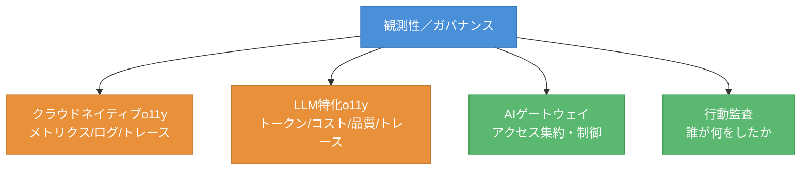
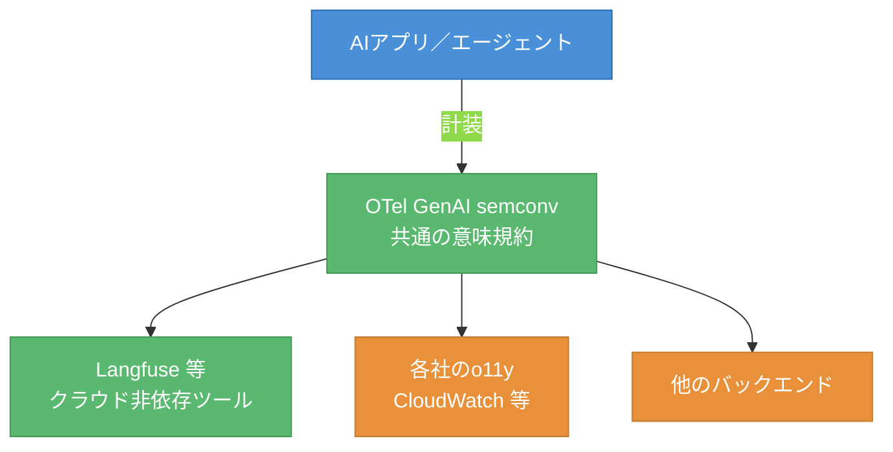
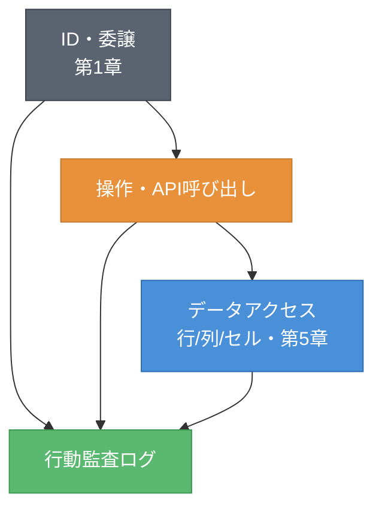
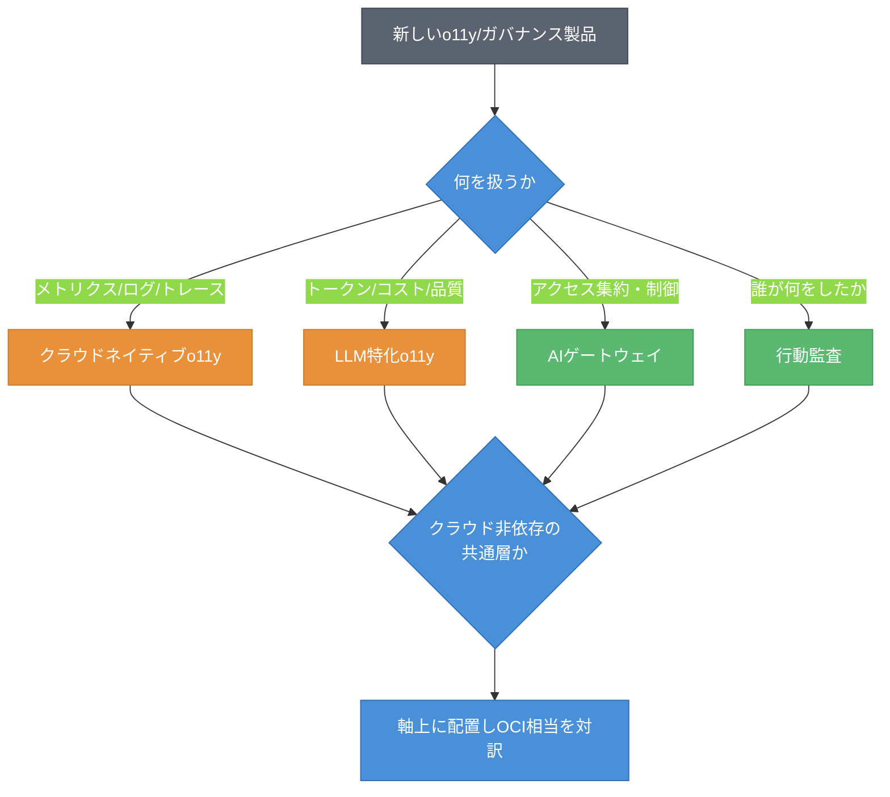

# 第6章 観測性／ガバナンス ― クラウドネイティブo11y・LLM特化o11y・AIゲートウェイ

第5章までで、アプリ側・データ側のAIが揃い、AIの中核の地図が完成した。本章では、動かしたAIを「どう観測し、どう統治するか」、すなわち観測性／ガバナンスへと地図を進める。AIワークロードは、動かすだけでは終わらない。何が起き、誰が何をし、コストはどう積み上がったかを見張り、統治する必要がある。本章を読み終えると、4社の観測性・ガバナンス機能を、クラウドネイティブo11y・LLM特化o11y・AIゲートウェイ・行動監査という軸で置けるようになる。そして、クラウドに依存しない共通層がこの領域でどう効くかを理解できるようになる。

## 6.1 軸の導入 ― 観測性とガバナンスを4つの層で切る

観測性（Observability、o11y）とガバナンスは、製品が多く境界も曖昧である。これを4つの軸で切る。図6.1に示す。



図6.1: 観測性／ガバナンスの4つの軸

第1の軸はクラウドネイティブo11yで、メトリクス・ログ・トレースという従来の三本柱を扱う。第2の軸はLLM特化o11y（LLM Observability）で、トークン消費・コスト・出力品質・エージェントのトレースといった、生成AIに固有の観測を扱う。第3の軸はAIゲートウェイ（AI Gateway）で、AIモデルへのアクセスを集約・制御・監査する中間層である。第4の軸は行動監査（Action Audit）で、人やエージェントが「誰が何をしたか」を記録・追跡する。

ガバナンスは、制御（ゲートウェイ）と監査（行動監査）の両輪で成り立つ。従来のo11yは成熟しているが、LLM特化o11yとAIゲートウェイは発展途上であり、各社の差が出やすい。

## 6.2 クラウド非依存の共通層 ― OTel GenAI semconv と Langfuse

この領域には、特定のクラウドに依存しない共通層がある。これを先に位置づけておくと、各社の製品が見通しやすくなる。図6.2に示す。



図6.2: クラウド非依存の共通観測層と各社サービスの関係

OTel GenAI semconv（OpenTelemetry GenAI Semantic Conventions、生成AIの観測データに関するOpenTelemetryの意味規約）は、LLMの観測データをどう表現するかを標準化する。これにクラウド非依存ツールの Langfuse などが続く。これらは「軸の横串」である。どの事業者の上でAIを動かしていても、共通の規約・ツールで観測できる。これはロックインを避ける観点で重要である。リスト6.1にOTel GenAI semconvの属性イメージを示す。

**リスト6.1: OTel GenAI semconv の属性例（概念例・YAML）**

```yaml
# 生成AI呼び出しのスパン属性（概念例）
gen_ai.provider.name: "the-model-provider"   # 旧 gen_ai.system は非推奨
gen_ai.request.model: "your-model-name"
gen_ai.usage.input_tokens: 1024
gen_ai.usage.output_tokens: 256
```

共通層を先に押さえると、各社のLLM特化o11yは「この共通規約にどう対応し、どこを自社で付加価値化しているか」という見方で整理できる。

## 6.3 4社プロット ― o11y・ゲートウェイ・監査

軸ができたので、4社の製品を並べる。表6.1に4社プロットを示す。

表6.1: 観測性／ガバナンスの4社プロット（確認日 2026-06-09）

| 軸 | AWS | Azure | Google Cloud | OCI（原点） |
|----|-----|-------|--------------|------|
| クラウドネイティブo11y | Amazon CloudWatch | Azure Monitor | Cloud Operations（Logging/Monitoring） | OCI Observability（Logging/Monitoring） |
| LLM特化o11y | CloudWatch ＋ Bedrock のメトリクス等 | Azure Monitor ＋ Foundry の評価/監視 | Cloud Operations ＋ Vertex の評価/監視 | OCI o11y ＋ 共通層の活用（要確認） |
| AIゲートウェイ | Bedrock 経由の集約等 | Foundry/API Management 経由 | Apigee/Vertex 経由 | API Gateway ＋ 共通層（要確認） |
| 行動監査 | CloudTrail | Microsoft Purview / Agent 365 | Cloud Audit Logs | OCI Audit ＋ Deep Data Security の監査 |

クラウドネイティブo11yは各社とも成熟しており、メトリクス・ログ・トレースを一通り備える。一方、LLM特化o11yとAIゲートウェイは発展途上で、各社が自社サービスと共通層を組み合わせて提供する。OCIはこの領域で共通層（OTel／Langfuse）の活用に依存する面があり、確認日付きで扱う。行動監査は、ID（第1章）とデータ層（第5章）の監査がここに合流する。

## 6.4 対訳（他社→OCI）と両方向ギャップ

代表サービスのOCI相当を対訳記号で示し、両方向ギャップを整理する。表6.2に示す。

表6.2: 観測性／ガバナンスの対訳表と両方向ギャップ（他社→OCI、確認日 2026-06-09）

| 他社の機能 | OCI相当 | 記号 | 注記 |
|-----------|---------|------|------|
| Amazon CloudWatch | OCI Observability（Logging/Monitoring） | ≒ | 従来型o11yとして対応 |
| AWS CloudTrail | OCI Audit | ≒ | API操作の監査として対応 |
| 各社のLLM特化o11y機能 | OCI o11y ＋ 共通層 | △ | 自社作り込みに差。共通層で補う。要確認 |
| 各社のAIゲートウェイ | API Gateway ＋ 共通層 | △ | 専用AIゲートウェイの作り込みに差。要確認 |

| 両方向ギャップ | 内容 |
|---------------|------|
| 他社にありOCIにない | LLM特化o11y・AIゲートウェイの専用機能の作り込み（要確認） |
| OCIにあり他社にない | Deep Data Security の監査によるデータ層の行動監査の一貫性（第5章と接続）。要確認 |

従来型o11yと監査は ≒ で対応する成熟領域である。一方、LLM特化o11yとAIゲートウェイには △ が付く。これらは発展途上で、OCIは共通層の活用で補う面がある。共通層を使えば事業者を問わず観測できるため、この △ は共通層で実質的に埋められることも多い。

## 6.5 ケイパビリティ・カード ― 行動監査（人とエージェント）

ガバナンスの片輪である行動監査をカード化する。人だけでなく、自律的に動くエージェントの行動も監査の対象になる。

### ケイパビリティ・カード: 行動監査（人とエージェント）

- **課題**: 人やAIエージェントが、いつ・誰として・何に・どんな操作をしたかを記録し、後から追跡したい。API操作だけでなく、データへのアクセスや、エージェントの自律的な行動まで一貫して追えると望ましい。
- **OCIでの実現**: OCI Audit がAPI操作を記録する。これに加えて、Deep Data Security の監査（第5章）がデータ層での行・列・セルへのアクセスを記録する。第1章のID伝播で運ばれた身元が、監査ログの主体として記録される。要確認。
- **他社での実現**: AWS は CloudTrail でAPI操作を、Lake Formation 等でデータアクセスを監査する。Azure は Microsoft Purview に加え、Microsoft Agent 365（2026-05-01 GA）でエージェントのID・権限・ポリシー・監査証跡を統制する。Google Cloud は Cloud Audit Logs で記録する。
- **差分の見立て**: API操作の監査はどの社も成熟している。差が出るのは、データ層の行動（行・列・セル単位のアクセス）まで一貫して監査できるか、そしてエージェントの自律行動をどう監査するかである。前者はOCIの Deep Data Security が強みになりうる。後者は Azure の Agent 365 のような専用の方向もある。優劣は出典のある範囲に限る。要確認。
- **確認日**: 2026-06-09

図6.3に、行動監査の貫通を示す。IDから操作、データアクセスまでが縦に貫かれる様子である。



図6.3: 行動監査の貫通（IDから操作・データアクセスまで）

行動監査は、ID（第1章）とデータ層（第5章）を縦に貫く。IDが「誰か」を、操作が「何をしたか」を、データアクセスが「どのデータに触れたか」を記録する。この縦の貫通が、AIエージェント時代のガバナンスの要になる。

## 6.6 SWOTスライスと新顔の分類手順・確認日

各社のSWOTスライスを表6.3にまとめる。OCIの弱みを必ず含める。

表6.3: 観測性／ガバナンスのSWOTスライス（確認日 2026-06-09）

| 観点 | 内容 |
|------|------|
| AWS（強み/弱み） | S: CloudWatch/CloudTrail の成熟、広い統合。W: LLM特化o11yは専用色が薄め |
| Azure（強み/弱み） | S: Purview と Agent 365（GA済み）によるエージェント統制。W: 製品群が多く全体像が複雑 |
| Google Cloud（強み/弱み） | S: Cloud Operations の完成度、Apigee の実績。W: エコシステムがGoogle中心 |
| OCI（強み/弱み） | S: Audit と Deep Data Security 監査によるデータ層の一貫性。**W: LLM特化o11y・AIゲートウェイの専用機能で他社・共通層に依存しがち（要確認）** |

この領域では、従来型o11yと監査はOCIも他社も成熟している。OCIの強みはデータ層の行動監査の一貫性に出る。一方、LLM特化o11yとAIゲートウェイの専用機能では、OCIは他社や共通層に依存する面があり、これがOCIの弱みになりうる。共通層が事業者非依存で使えることは、この弱みを実質的に和らげる。

未知の観測性／ガバナンス製品を地図に置く手順を、図6.4に示す。



図6.4: o11y/ガバナンス新製品の分類フロー

手順は二段階である。まず「何を扱うか（メトリクス系・LLM特化・ゲートウェイ・監査）」で4つの軸のどれかに置く。次に「クラウド非依存の共通層か、事業者固有か」を判定し、軸上に置いてOCI相当を対訳する。共通層か否かで、その製品がロックインを避ける選択肢になるかが分かる。

本章では、観測性／ガバナンスを4つの軸で捉え、クラウド非依存の共通層がこの領域でどう効くかを見た。これで全6領域（ID・実行基盤・ストレージ・マネージドAI・データ側AI・観測性/ガバナンス）の地図が出そろった。次の章では、領域ごとに描いた地図を1枚に統合する。領域ごとの地図から、1枚の全体地図へと移る。

## 理解度チェック

### Q1. 2種類のo11y

**種類**: 概念の確認

**難易度**: 基礎

**問題文**:
クラウドネイティブo11yとLLM特化o11yの違いを、それぞれが扱う対象に着目して説明せよ。

<details>
<summary>解答と解説</summary>

**解答**: クラウドネイティブo11yは、メトリクス・ログ・トレースという従来の三本柱を扱い、システム全般の状態を観測する。LLM特化o11yは、トークン消費・コスト・出力品質・エージェントのトレースといった、生成AIに固有の観測対象を扱う。前者は成熟領域、後者は発展途上で各社の差が出やすい。

**解説**: AIワークロードでは従来のo11yに加え、生成AI固有の観測が必要になる。両者を分けて見ることで、各社の成熟度の差を整理できる。

**関連する節**: 6.1

</details>

---

### Q2. 共通層が「横串」として効く理由

**種類**: 概念の確認

**難易度**: 応用

**問題文**:
OTel GenAI semconv や Langfuse を、本書が「軸の横串」と呼ぶのはなぜか。説明せよ。

<details>
<summary>解答と解説</summary>

**解答**: OTel GenAI semconv は生成AIの観測データの表現を標準化する意味規約であり、Langfuse はクラウド非依存の観測ツールである。これらはどの事業者の上でAIを動かしていても共通に使える。特定のクラウドに閉じず、4社いずれの上でも観測を成立させるため、軸を横断する「横串」として効く。

**解説**: 共通層を使えばロックインを避けられる。各社のLLM特化o11yは「この共通規約にどう対応し、どこを自社で付加価値化しているか」という見方で整理できる。

**関連する節**: 6.2、6.4

</details>

---

### Q3. 行動監査の縦の貫通

**種類**: 概念の確認

**難易度**: 応用

**問題文**:
行動監査が、第1章（ID）と第5章（データ層）とどのようにつながるか。「縦の貫通」という観点で説明せよ。

<details>
<summary>解答と解説</summary>

**解答**: 行動監査は、IDが「誰か」を、操作が「何をしたか」を、データアクセスが「どのデータ（行・列・セル）に触れたか」を記録する。第1章のID伝播で運ばれた身元が監査ログの主体になり、第5章のデータ層認可（Deep Data Security の監査）がデータアクセスを記録する。IDから操作、データアクセスまでが縦に貫かれ、これがAIエージェント時代のガバナンスの要になる。

**解説**: 監査はID・操作・データの3層を縦に貫く。OCIは Audit と Deep Data Security 監査でデータ層まで一貫させる点に強みが出やすい。

**関連する節**: 6.5

</details>

---

### Q4. AI特化o11yが要件の案件の設計

**種類**: 設計問題

**難易度**: 応用

**問題文**:
ある案件で、LLM特化o11y（トークン・コスト・品質・トレースの観測）が要件になった。OCIでこれを実現する際、本章のSWOTで指摘されたOCIの弱みをどう補うか、設計の考え方を述べよ。

<details>
<summary>解答と解説</summary>

**解答**: (1) OCIのLLM特化o11yは専用機能で他社に追う面がある（弱み）ため、クラウド非依存の共通層を積極的に活用する。(2) AIアプリ／エージェントを OTel GenAI semconv で計装し、トークン・コスト・品質・トレースを共通規約で収集する。(3) 収集データを Langfuse 等のクラウド非依存ツール、または OCI Observability に送る。(4) 共通層は事業者非依存で使えるため、OCIの専用機能の不足を実質的に補える。(5) 行動監査が必要なら OCI Audit と Deep Data Security 監査を併用する。

**解説**: 弱み（専用機能の不足）を、共通層（OTel/Langfuse）という横串で埋めるのが設計の要点である。共通層はロックインも避けられる。

**関連する節**: 6.2、6.6

</details>

---

### Q5. 共通層中心か、各社専用機能中心か

**種類**: 判断問題

**難易度**: 応用

**問題文**:
ある案件で、複数クラウドにまたがるAIアプリのLLM観測を、ロックインを避けつつ一元化したい。OTel／Langfuse などの共通層を中心に据える構成と、各社のLLM特化o11y専用機能を中心に据える構成のどちらを選ぶべきか。理由とともに判断せよ。

**選択肢**:
- (a) 各社のLLM特化o11y専用機能を中心に据える
- (b) OTel／Langfuse などの共通層を中心に据える
- (c) 行動監査（CloudTrail 等）だけで代替する
- (d) クラウドネイティブo11yのみで足りる

<details>
<summary>解答と解説</summary>

**解答**: (b) OTel／Langfuse などの共通層を中心に据える

**解説**: 要件は「複数クラウドにまたがる」「ロックインを避ける」「一元化」である。各社専用機能（a）は事業者ごとに分断され、ロックインを招く。共通層（OTel GenAI semconv ＋ Langfuse 等）は事業者非依存の横串であり、どのクラウド上のAIも共通規約で計装・収集でき、一元化とロックイン回避を両立できる。行動監査（c）やクラウドネイティブo11yのみ（d）では、LLM特化の観測対象（トークン・コスト・品質）をカバーできない。

**関連する節**: 6.2、6.6

</details>

---

## 参考文献

- Amazon Web Services "Amazon CloudWatch / AWS CloudTrail Documentation" , https://docs.aws.amazon.com/cloudwatch/ （確認日: 2026-06-09）
- Microsoft "Azure Monitor / Microsoft Purview / Microsoft Agent 365 Documentation" , https://learn.microsoft.com/azure/azure-monitor/ （確認日: 2026-06-09）
- Google "Google Cloud Observability (Cloud Operations) / Cloud Audit Logs / Apigee" , https://docs.cloud.google.com/stackdriver/docs （確認日: 2026-06-09）
- Oracle "OCI Observability and Management / OCI Audit Documentation" , https://docs.oracle.com/en-us/iaas/Content/Logging/home.htm （確認日: 2026-06-09）
- OpenTelemetry "Semantic Conventions for Generative AI" , https://opentelemetry.io/docs/specs/semconv/gen-ai/ （確認日: 2026-06-09）
- Langfuse "Langfuse Documentation" , https://langfuse.com/docs （確認日: 2026-06-09）

[^1]: OTel GenAI semconv（OpenTelemetry GenAI Semantic Conventions）は生成AIの観測データの意味規約である（https://opentelemetry.io/docs/specs/semconv/gen-ai/）。規約は更新が続くため属性名は確認日付きで扱う（確認日: 2026-06-09）。

## 確認日

- 本章の基準日: 2026-06-09
- 特に陳腐化しやすい項目: 各社のLLM特化o11y機能名とAIゲートウェイの提供状態、OTel GenAI semconv の属性名、Microsoft Agent 365 等のエージェント監査機能、OCIのLLM特化o11y・AIゲートウェイの専用機能の有無。次回更新時に各社公式ドキュメントで再確認すること。
