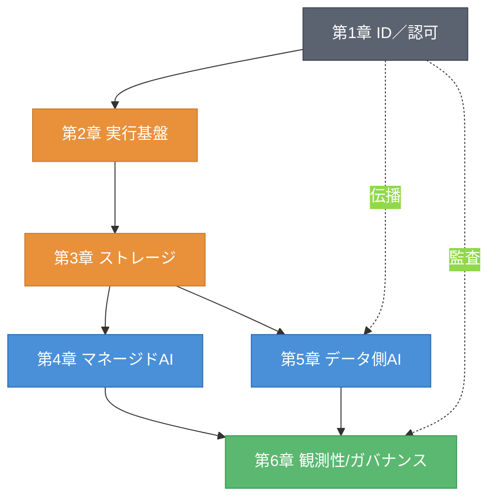
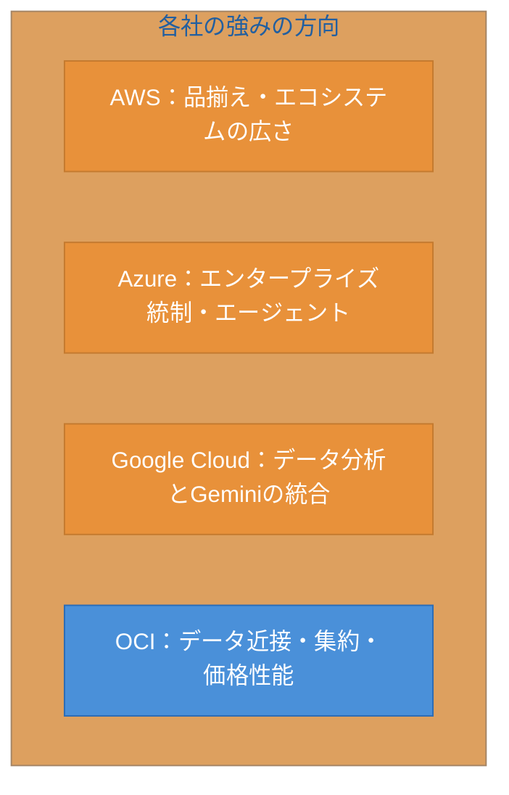
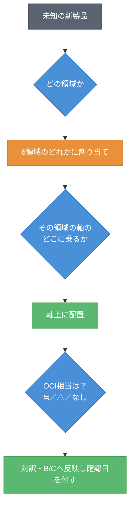

# 統合章 地図の全体像 ― 対訳辞書・両方向ギャップ・AIワークロードSWOT

第6章までで、全6領域（アイデンティティ／認可、実行基盤、オブジェクトストレージ、マネージドAI、データ側AI、観測性／ガバナンス）の地図が出そろった。本章では、領域ごとに描いた地図を1枚に統合する。集約するのは4つである。他社製品→OCIの対訳辞書（A）、他社にありOCIにない一覧（B）、OCIにあり他社にない一覧（C）、そしてAIワークロードのSWOT（D）である。これらは本書の必須コンテンツ5点の総まとめにあたる。本章を読み終えると、領域をまたいだ全体像が1枚で見渡せ、未知の新製品を全体地図に置く統合手順を手にできる。

## 統.1 6領域を1枚に重ねる ― 全体地図の構造

まず、6領域を1枚に重ねた全体地図の構造を示す。図統.1に俯瞰図を示す。

図統.1: AIワークロード全体地図（6領域×4社の俯瞰）

全体地図は、土台（ID・実行基盤・ストレージ）の上にAIの中核（マネージドAIとデータ側AI）が乗り、それらを観測性／ガバナンスが見張るという構造である。縦糸として、ID（第1章）が委譲・伝播を通じてデータ側AI（第5章）の認可まで貫通し、さらに行動監査（第6章）まで届く。この縦糸が、AIワークロードを一貫させる背骨である。各領域の軸を思い出せば、この1枚から全体を再構成できる。

## 統.2 対訳辞書（A）― 他社製品→OCI相当の総まとめ

各領域章の対訳を1つの辞書に集約する。表統.1に横断対訳辞書を示す。代表的な他社製品を引けば、OCI相当が対訳記号付きで分かる。

表統.1: 他社→OCI 横断対訳辞書（確認日 2026-06-09）

| 領域 | 他社の代表製品 | OCI相当 | 記号 |
|------|--------------|---------|------|
| ID | Microsoft Entra ID（ワークフォース） | IAM with Identity Domains | ≒ |
| ID | Amazon Cognito（CIAM） | IAM with Identity Domains | ≒ |
| ID | Entra OBO（委譲） | Token Exchange ＋ Identity Propagation Trust | △ |
| ID | Entra Agent ID（GA済み） | プリンシパル＋伝播で組み立て | なし／△ |
| 実行基盤 | Amazon EKS / AKS / GKE | OKE | ≒ |
| 実行基盤 | AWS Fargate / Cloud Run | OCI Container Instances | △ |
| ストレージ | Amazon S3 | OCI Object Storage | ≒ |
| ストレージ | S3 署名付きURL | 事前認証リクエスト（PAR） | ≒ |
| マネージドAI | Amazon Bedrock | OCI Generative AI | ≒ |
| マネージドAI | Microsoft Foundry | OCI Generative AI | ≒ |
| マネージドAI | Gemini Enterprise Agent Platform（旧 Vertex AI） | OCI Generative AI | ≒ |
| マネージドAI | Bedrock Knowledge Bases（RAG） | OCI Generative AI Agents のRAG機能 | △ |
| マネージドAI | Bedrock AgentCore（エージェント） | OCI Generative AI Agents | △ |
| データ側AI | pgvector（Aurora/AlloyDB） | Oracle AI Vector Search | ≒ |
| データ側AI | BigQuery ML（SQLからのLLM） | Select AI | ≒ |
| データ側AI | ID伝播＋RLS/CLS | Deep Data Security | △ |
| o11y | Amazon CloudWatch | OCI Observability | ≒ |
| o11y | AWS CloudTrail | OCI Audit | ≒ |

辞書全体を眺めると、成熟領域（ID基盤、実行基盤、ストレージ、従来型o11y）に ≒ が多く、新興領域（委譲・伝播、エージェント、マネージドRAG、データ層認可）に △ や なし が現れる。差が出るのは新興領域である、という本書の見立てが、辞書のうえでも確認できる。

## 統.3 両方向ギャップ（B・C）― 双方向の差分一覧

「他社にありOCIにない」（B）と「OCIにあり他社にない」（C）を、全領域から集約する。表統.2にB、表統.3にCを示す。

表統.2: 他社にありOCIにない一覧（B、確認日 2026-06-09）

| 領域 | 他社にありOCIにない |
|------|---------------------|
| ID | エージェント専用ID製品（Entra Agent ID、2026-05-01 GA）、大規模CIAM特化の高度機能の一部 |
| 実行基盤 | GKE Autopilot のような成熟したノード全自動運用、Cloud Run のリクエスト駆動の作り込み |
| ストレージ | S3を中心としたサードパーティ統合・データエコシステムの相対的な広さ |
| マネージドAI | 基盤モデルの品揃えの幅、エージェント・RAG周辺機能の厚み |
| データ側AI | クラウドネイティブ分析エコシステム（BigQuery 等）、PostgreSQL系の選択肢の幅 |
| o11y | LLM特化o11y・AIゲートウェイの専用機能の作り込み |

表統.3: OCIにあり他社にない一覧（C、確認日 2026-06-09）

| 領域 | OCIにあり他社にない（設計の重心の差） |
|------|--------------------------------------|
| ID | ワークフォースとCIAMを単一の Identity Domains で統合する設計 |
| ストレージ | S3互換API＋Autonomous Database近接（自律運用DBとの統合という点に限る） |
| マネージドAI | データ側AIとの近接を設計の重心に据えたマネージドAI |
| データ側AI | DB内に認可・ベクトル・LLMを集約し生成元を問わず一貫させる設計（Deep Data Security ＋ Select AI ＋ AI Vector Search） |
| o11y | Deep Data Security 監査によるデータ層の行動監査の一貫性 |

Bを見ると、OCIが追う立場になりやすいのは、品揃え・エコシステムの広さと、エージェント・LLM特化の専用機能である。Cを見ると、OCIの固有性は「統合・集約・一貫性」という設計の重心に集まる。多くは排他的な機能差ではなく、設計思想の置き方の差である。この点は本書の各領域章で出典付き・確認日付きに扱った範囲に限る。

## 統.4 AIワークロードSWOT（D）― 4社の総合評価

各領域のSWOTスライスを統合し、4社の総合SWOTを示す。図統.2に総合像、表統.4に統合表を示す。OCIの弱みを必ず含める。

図統.2: 4社のAIワークロードSWOT総合（強みの方向）

表統.4: SWOT統合表（領域横断、確認日 2026-06-09、本書の見立て）

| 事業者 | 強み（S） | 弱み（W） |
|--------|----------|----------|
| AWS | 品揃え・エコシステムの広さ、サービス統合の厚み | 構成要素が多く全体把握が難しい、認可がサービスごとに分散しがち |
| Azure | エンタープライズ浸透、エージェント統制（Agent 365）、OpenAI等との関係 | ブランド改称が多い、製品群が複雑 |
| Google Cloud | データ分析（BigQuery）とGeminiの統合、運用自動化 | エコシステムがGoogle中心、Oracle系資産との連携が限定的 |
| OCI | データ側AIとの近接・集約・一貫性、価格性能、標準準拠の伝播 | 品揃え・エコシステムの広さ、エージェント・LLM特化の専用機能で追う立場になりうる |

総合すると、各社の強みは異なる方向を向いている。AWSは広さ、Azureはエンタープライズ統制、Google Cloudはデータ分析との統合、OCIはデータ近接と集約・一貫性である。OCIの弱みは品揃えとエコシステムの広さに集まる。優劣の断定は各領域章の出典・確認日に従い、本表は本書の見立てである。

## 統.5 地図の使い方 ― 新顔を全体地図に置く統合手順

最後に、各領域章の「新顔の分類手順」を統合する。未知の新製品を全体地図に置く統合フローを、図統.3に示す。

図統.3: 新製品を全体地図に置く統合分類フロー

統合手順は三段階である。まず「どの領域か」を決め（6領域のどれか）、次に「その領域の軸のどこに乗るか」を判断して軸上に置く。最後に「OCI相当は何か」を ≒／△／なし で対訳し、必要ならB（他社にありOCIにない）かC（OCIにあり他社にない）に反映し、確認日を付す。この三段階で、どんな新製品も全体地図に位置づけられる。これが本書の到達目標である「賞味期限のない能力」の完成形である。

本章では、6領域の地図を1枚に統合し、対訳辞書・両方向ギャップ・SWOT・統合分類手順をまとめた。これで全体地図が完成した。次の章では、この完成した地図の語彙を使って、実際の各社公式リファレンスアーキテクチャを読み解く。描いた地図で、本物のRAを読む。

## 理解度チェック

### Q1. 必須コンテンツ5点と本章の成果物

**種類**: 概念の確認

**難易度**: 基礎

**問題文**:
本書の必須コンテンツ5点（対訳／他社にありOCIにない／OCIにあり他社にない／部品ごとの実現方式／SWOT）は、本章のどの成果物に対応するか。対応づけて述べよ。

解答と解説

**解答**: 対訳→対訳辞書（A、表統.1）、他社にありOCIにない→B一覧（表統.2）、OCIにあり他社にない→C一覧（表統.3）、SWOT→SWOT統合表（D、表統.4）。部品ごとの実現方式は、各領域章の4社プロットと対訳を集約した対訳辞書（A）と全体地図（図統.1）に反映されている。

**解説**: 本章は必須コンテンツ5点を領域横断で集約・重複排除したものである。各成果物が5点のどれを満たすかを意識すると、本書の全体像が掴める。

**関連する節**: 統.2、統.3、統.4

---

### Q2. 対訳辞書を引く

**種類**: 判断問題

**難易度**: 基礎

**問題文**:
他社製品「Amazon Bedrock Knowledge Bases」を横断対訳辞書（表統.1）で引くと、OCI相当と対訳記号はどうなるか。

**選択肢**:
- (a) OCI Object Storage（≒）
- (b) OCI Generative AI Agents のRAG機能（△）
- (c) Oracle AI Vector Search（≒）
- (d) 相当なし

解答と解説

**解答**: (b) OCI Generative AI Agents のRAG機能（△）

**解説**: Bedrock Knowledge Bases はマネージドRAGであり、OCIでは OCI Generative AI Agents のRAG機能が対応する。構成要素の作り込みに差があるため △ である（第4章）。対訳辞書は、他社製品からOCI相当を即座に引くための索引として使える。

**関連する節**: 統.2

---

### Q3. 新製品を全体地図に置く

**種類**: 設計問題

**難易度**: 応用

**問題文**:
ある事業者が「データベースに統合された新しいベクトル検索＋自然言語クエリ機能」を発表した。本章の統合分類フロー（図統.3）に沿って、この製品を全体地図に置く手順を設計せよ。

解答と解説

**解答**: (1) どの領域か→「データベースに統合」「ベクトル検索」「自然言語クエリ」なのでデータ側AI（第5章）の領域。(2) その領域の軸のどこか→DB内ベクトルとSQLからのLLM／NL→SQLの軸に乗る。(3) OCI相当→Oracle AI Vector Search ＋ Select AI に ≒ で対応づく可能性が高い。(4) B/Cへの反映→もし他社固有の強みがあればB、OCI固有ならCに反映。(5) 確認日を付してスナップショットとして記録する。

**解説**: 「どの領域か→軸のどこか→OCI相当は何か」の三段階が統合手順の核である。領域章の軸と対訳辞書を組み合わせれば、新製品も迷わず全体地図に置ける。

**関連する節**: 統.5

---

### Q4. OCIの固有性の性質

**種類**: 判断問題

**難易度**: 応用

**問題文**:
C一覧（表統.3「OCIにあり他社にない」）に並ぶ項目の多くは、どのような性質の差か。最も適切なものを選べ。

**選択肢**:
- (a) 他社には存在しない排他的な機能の差
- (b) 機能の有無ではなく、統合・集約・一貫性という設計の重心の置き方の差
- (c) 価格だけの差
- (d) 提供リージョン数の差

解答と解説

**解答**: (b) 機能の有無ではなく、統合・集約・一貫性という設計の重心の置き方の差

**解説**: C一覧の項目（Identity Domainsの統合、データ近接、DB内集約、データ層監査の一貫性）は、多くが排他的な機能差ではない。他社も同等の結果を実現できる場合が多く、OCIの固有性は「統合・集約・一貫性をどこに置くか」という設計思想の重心に集まる。本書は排他性を断定せず、出典・確認日付きで扱う。

**関連する節**: 統.3、統.4

---

## 参考文献

- 本章は第1〜6章の集約である。各事実の一次情報・確認日は、対応する領域章の参考文献を参照のこと。
  - 第1章（ID）、第2章（実行基盤）、第3章（ストレージ）、第4章（マネージドAI）、第5章（データ側AI）、第6章（観測性／ガバナンス）

## 確認日

- 本章の基準日: 2026-06-09
- 本章は各領域章の集約であり、個々の事実の確認日は対応する領域章に従う。集約表（対訳辞書・B/C一覧・SWOT統合表）を更新する際は、各領域章の最新の確認日を反映すること。
