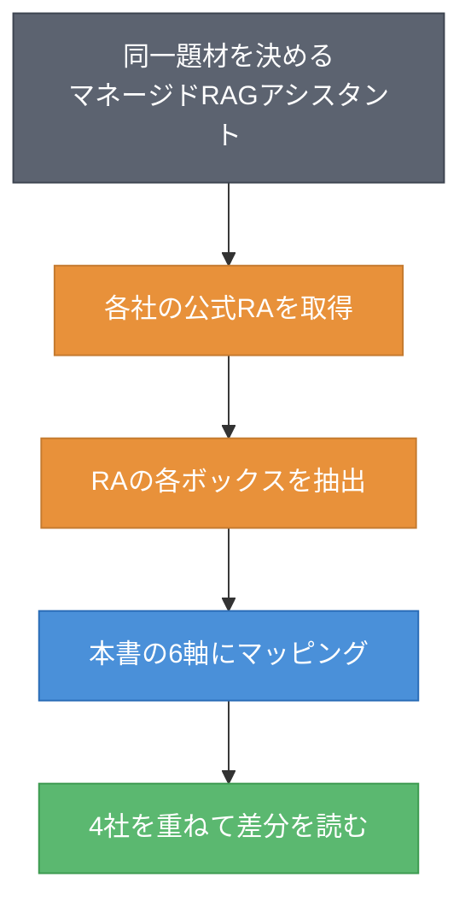
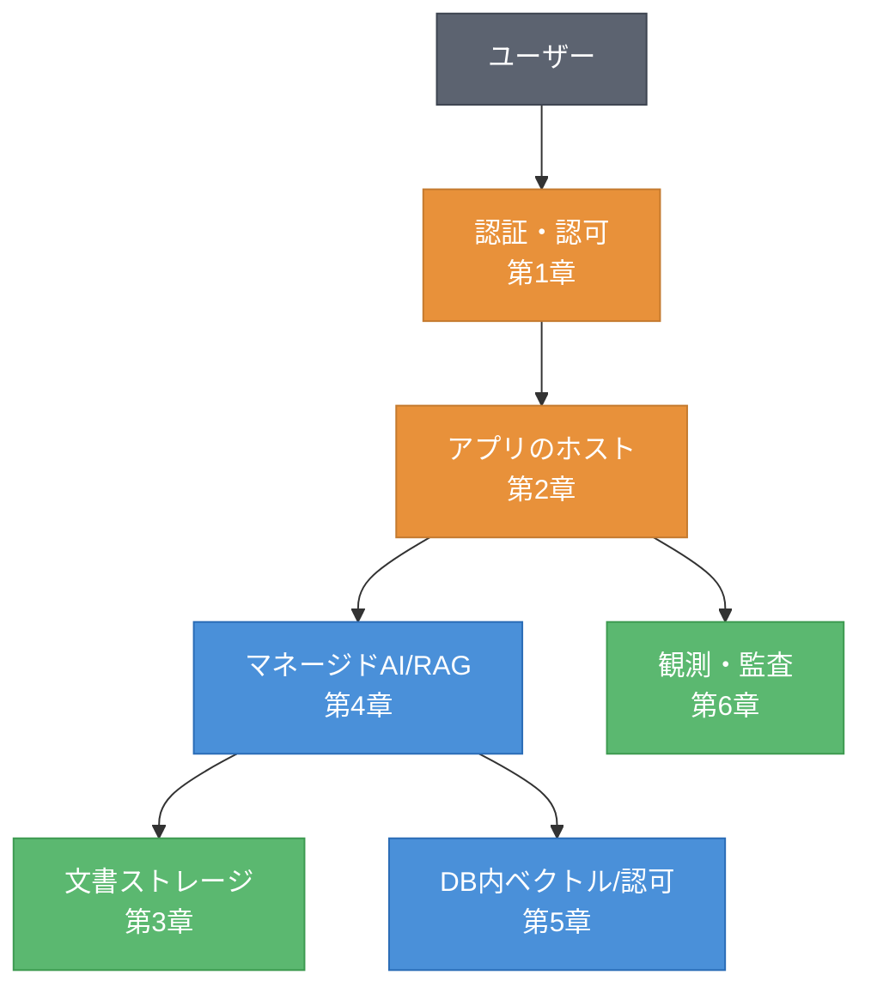
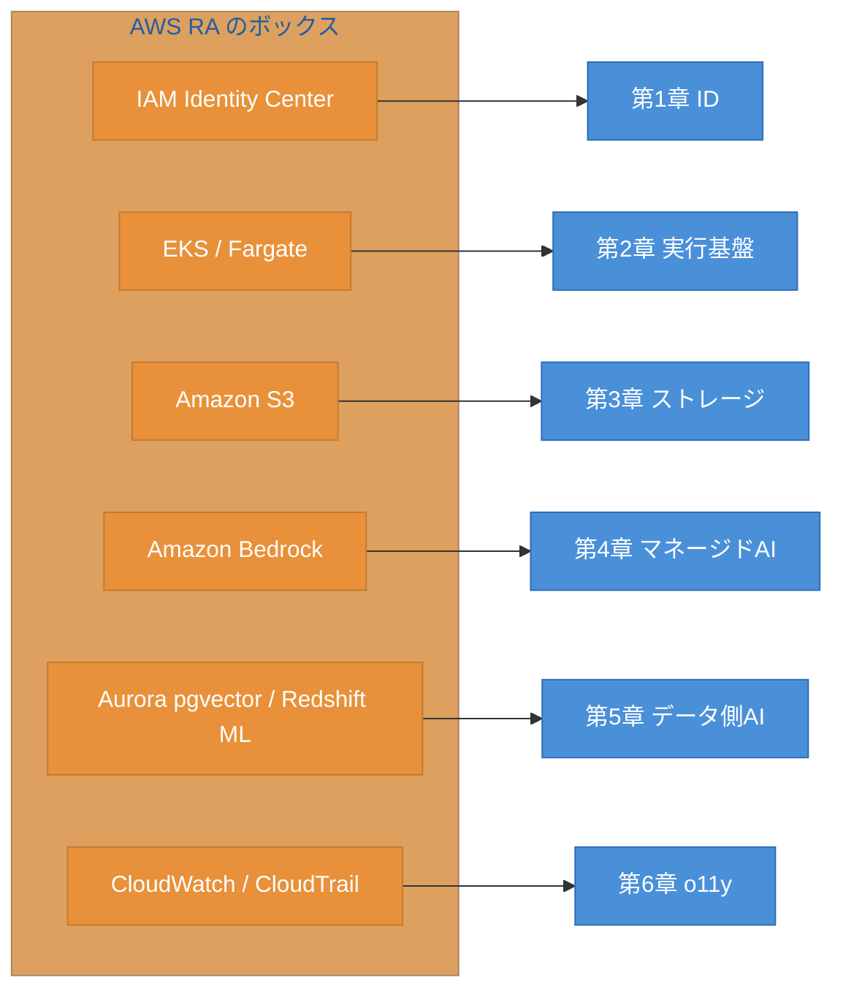
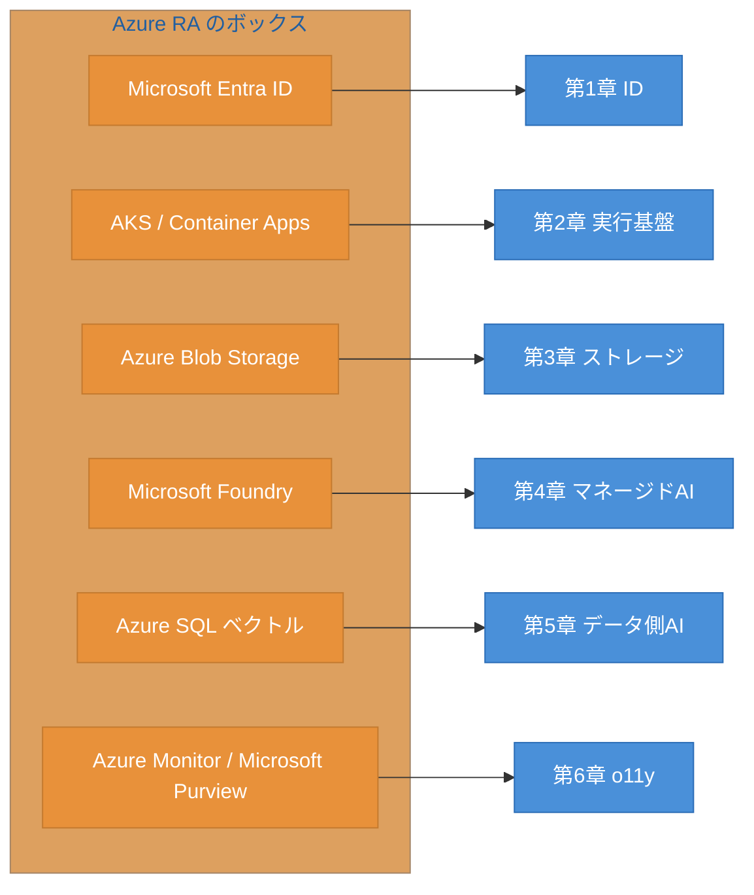
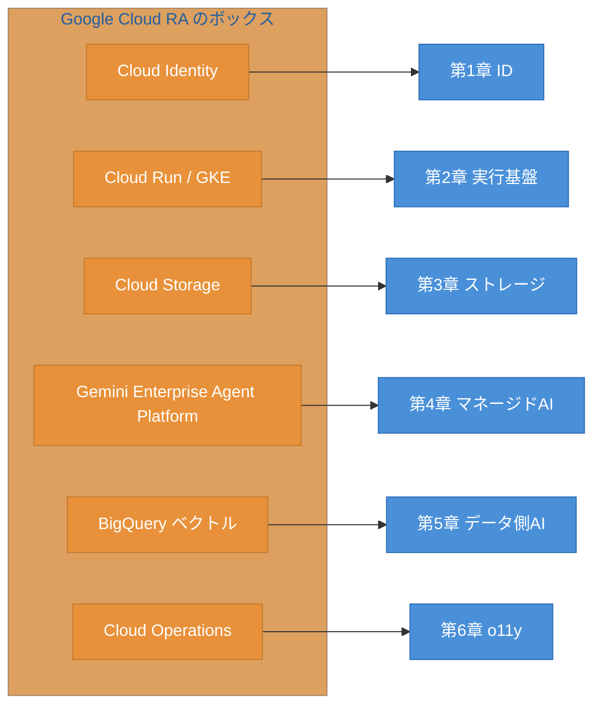
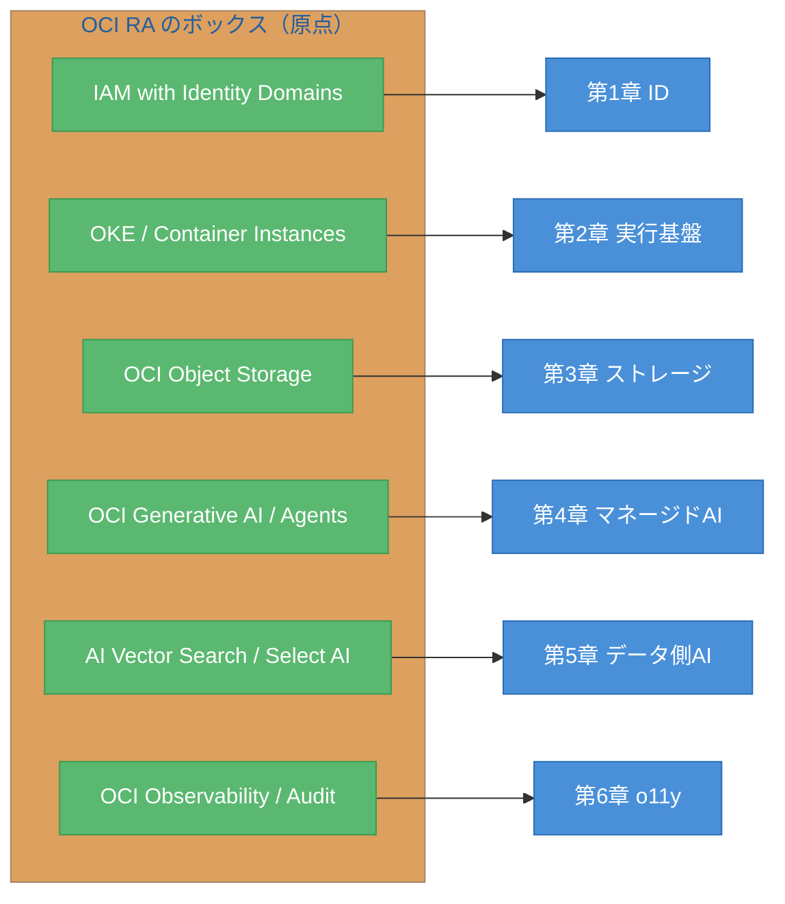

# 終章 公式RA読み比べ ― 同一題材で4社のリファレンスアーキテクチャを読む

統合章で、6領域の地図を1枚に統合した。本章は本書のcapstone（総仕上げ）である。完成した地図の語彙を使って、実際の各社公式リファレンスアーキテクチャ（Reference Architecture、RA）を読み解く。題材は4社で共通にする。マネージドRAGアシスタントである。各社のRAに描かれた箱を、本書の軸（6領域）にマッピングしていく。本章では構築を一切行わない。読んで、地図に載せるだけである。本章を読み終えると、未知のRAに出会っても、本書の軸でそれを読み解けるようになる。これが本書の到達目標、賞味期限のない能力の確認である。

## 終.1 capstoneの方法 ― 公式RAを軸の語彙で読む

本章のやり方を先に示す。図終.1にRA読解の方法を示す。

図終.1: RA読解の方法（ボックス→軸へのマッピング手順）

手順は単純である。まず同一題材を決め、各社の公式RAを取得する。次にRAに描かれた各ボックス（サービス・コンポーネント）を抽出し、本書の6軸（ID・実行基盤・ストレージ・マネージドAI・データ側AI・観測性／ガバナンス）のどれに属するかをマッピングする。最後に4社のマッピング結果を重ね、差分を読む。同一題材だからこそ、4社を同じ土俵で比較できる。本書は構築せず、読解とマッピングに徹する。

## 終.2 題材の定義 ― マネージドRAGアシスタント

読み比べる共通題材を定義する。社内ドキュメントに対するマネージドRAGアシスタントである。ユーザーが自然言語で問い、社内文書を検索して、根拠付きで回答するシステムを想定する。この題材を、本書の軸の語彙であらかじめ部品に分解しておく。図終.2に示す。

図終.2: 共通題材の部品分解（本書の軸で表現）

マネージドRAGアシスタントは、本書の6軸すべてに触れる。ユーザーを認証・認可し（第1章）、アプリをホストに載せ（第2章）、文書をストレージに置き（第3章）、マネージドAI／RAGで生成し（第4章）、必要ならDB内ベクトルとデータ層認可を使い（第5章）、全体を観測・監査する（第6章）。この部品分解が、4社のRAを読み取る共通テンプレートになる。各社のRAは、これらの部品を自社の製品で埋めたものだと見ればよい。

## 終.3 AWS SRA GenAI を読む

最初にAWSのRAを読む。AWSは Security Reference Architecture（SRA）や生成AI向けのガイダンスを公式に提供している[^1]。そのボックスを本書の6軸にマッピングする。図終.3に示す。

図終.3: AWS RA の軸マッピング

AWSのRAでは、Bedrock を中核に据え、S3 を文書置き場に、IAM Identity Center で認可し、CloudWatch／CloudTrail で観測・監査する構成が典型である。本書の軸に載せると、第4章（マネージドAI）に Bedrock、第3章（ストレージ）に S3、第1章（ID）に IAM Identity Center が対応する。AWS固有の構成要素も、6軸のいずれかに収まる。

## 終.4 Azure AI Landing Zones を読む

次にAzureのRAを読む。Azureは AI Landing Zones として、AIワークロードの基盤設計を公式に提供している[^2]。図終.4にマッピングを示す。

図終.4: Azure RA の軸マッピング

AzureのAI Landing Zones は、ランディングゾーンというガバナンス重視の考え方が特徴である。Entra ID で認可し、Microsoft Foundry を中核に、Blob Storage を文書置き場にする。本書の軸に載せると、AWSと同じ6軸に収まる。違いはランディングゾーンによる統制の枠組みが前面に出る点で、これは第6章（ガバナンス）の比重が大きいと読める。

## 終.5 Google Cloud と OCI のRAを読む

Google Cloud と OCI のRAを読む。Google Cloud は Cloud Architecture Center[^3]、OCI は Architecture Center[^4] でRAを公開している。図終.5にGoogle Cloud、図終.6にOCIのマッピングを示す。

図終.5: Google Cloud RA の軸マッピング

図終.6: OCI RA の軸マッピング

Google Cloud のRAは、BigQuery のデータ分析・ベクトル検索を取り込む点が特徴で、第5章（データ側AI）の比重が大きい。OCIのRAは原点であり、これを基準に他社を相対配置できる。OCIでは AI Vector Search と Select AI（第5章）、OCI Generative AI Agents（第4章）が中核になる。OCIもデータ側AIの比重が大きく、Google Cloud と方向性が近いと読める。同一題材で並べると、各社が6軸のどこに重心を置くかの差が浮かび上がる。

## 終.6 4社RAの重ね合わせ ― 地図が読めることの確認

4社のマッピング結果を1枚に重ねる。表終.1に軸別対応表を示す。

表終.1: 4社RAの軸別対応表（重ね合わせ、確認日 2026-06-09）

| 本書の軸 | AWS | Azure | Google Cloud | OCI（原点） |
|---------|-----|-------|--------------|------|
| 第1章 ID | IAM Identity Center | Microsoft Entra ID | Cloud Identity | IAM with Identity Domains |
| 第2章 実行基盤 | EKS / Fargate | AKS / Container Apps | Cloud Run / GKE | OKE / Container Instances |
| 第3章 ストレージ | Amazon S3 | Azure Blob Storage | Cloud Storage | OCI Object Storage |
| 第4章 マネージドAI | Amazon Bedrock | Microsoft Foundry | Gemini Enterprise Agent Platform | OCI Generative AI / Agents |
| 第5章 データ側AI | Aurora pgvector / Redshift ML | Azure SQL ベクトル | BigQuery ベクトル | AI Vector Search / Select AI |
| 第6章 観測性/ガバナンス | CloudWatch / CloudTrail | Azure Monitor / Microsoft Purview | Cloud Operations | OCI Observability / Audit |

表終.1を見れば、どの社の公式RAも、本書の6軸という共通の語彙で読めることが分かる。製品名は社ごとに違い、これからも変わり続ける。しかし軸は変わらない。軸さえ頭にあれば、未知の公式RAに出会っても、各ボックスを6軸のどこかに置き、OCI相当を対訳し、地図に載せられる。

これで本書は終わる。序章で、製品ではなく軸を覚えること、OCIを原点に相対座標で語ること、陳腐化を確認日付きのスナップショットで扱うことを約束した。本書はその約束に沿って、6つの領域の地図を描き、1枚に統合し、最後に実際の公式RAを軸で読み解いた。地図は完成した。あとは、確認日を更新しながら、この地図を使い続けるだけである。読者が未知の新製品や新しいRAに出会ったとき、本書の軸がその位置を教えてくれる。それが、本書が渡したかった賞味期限のない能力である。

## 理解度チェック

### Q1. RAを軸の語彙でマッピングするとは

**種類**: 概念の確認

**難易度**: 基礎

**問題文**:
公式RAを「本書の軸の語彙でマッピングする」とは、具体的にどのような作業か。説明せよ。

解答と解説

**解答**: 公式RAに描かれた各ボックス（サービス・コンポーネント）を抽出し、それぞれが本書の6軸（ID・実行基盤・ストレージ・マネージドAI・データ側AI・観測性／ガバナンス）のどれに属するかを対応づける作業である。製品名そのものではなく、各ボックスが果たす役割（軸）で整理する。

**解説**: この作業により、製品名の異なる4社のRAを、共通の語彙（6軸）で同じ土俵に並べられる。同一題材を使えば、各社が軸のどこに重心を置くかの差も読める。

**関連する節**: 終.1、終.2

---

### Q2. RAのボックスを軸に置く

**種類**: 判断問題

**難易度**: 基礎

**問題文**:
ある公式RAに「Amazon Bedrock」というボックスがあった。本書のどの軸（章）に置くか。

**選択肢**:
- (a) 第1章 ID
- (b) 第3章 ストレージ
- (c) 第4章 マネージドAI
- (d) 第6章 観測性／ガバナンス

解答と解説

**解答**: (c) 第4章 マネージドAI

**解説**: Amazon Bedrock は基盤モデルを提供するマネージドAIサービスであり、本書の第4章（マネージドAI）の軸に置く。RAのボックスは、その役割（軸）で分類する。製品名が変わっても、役割で置けば迷わない。

**関連する節**: 終.3、終.6

---

### Q3. 未知のRAを軸で読み解く

**種類**: 設計問題

**難易度**: 応用

**問題文**:
本書では扱っていない、ある事業者の新しいマネージドRAGアシスタントの公式RAに出会った。本書の方法（終.1）に沿って、このRAを読み解き、4社と比較する手順を設計せよ。

解答と解説

**解答**: (1) 同一題材（マネージドRAGアシスタント）の部品分解（図終.2）を読み取りテンプレートとして用意する。(2) その事業者の公式RAを取得し、各ボックスを抽出する。(3) 各ボックスを本書の6軸（ID・実行基盤・ストレージ・マネージドAI・データ側AI・観測性／ガバナンス）にマッピングする。(4) OCIを原点として、各ボックスのOCI相当を対訳（≒／△／なし）で対応づける。(5) 表終.1の4社対応表に新しい列として重ね、どの軸に重心を置くかの差を読む。(6) 確認日を付してスナップショットとして記録する。

**解説**: 本書の軸は事業者を問わない共通の語彙である。新しいRAも同じ6軸でマッピングすれば、既存の4社と同じ土俵で比較できる。これが本書の到達目標「賞味期限のない能力」の実践である。

**関連する節**: 終.1、終.6

---

## 参考文献

- Amazon Web Services "AWS Security Reference Architecture / Generative AI guidance" , https://docs.aws.amazon.com/prescriptive-guidance/ （確認日: 2026-06-09、要確認）
- Microsoft "Azure AI Landing Zones / Cloud Adoption Framework" , https://learn.microsoft.com/azure/cloud-adoption-framework/ （確認日: 2026-06-09、要確認）
- Google "Google Cloud Architecture Center" , https://docs.cloud.google.com/architecture （確認日: 2026-06-09、要確認）
- Oracle "OCI Architecture Center" , https://docs.oracle.com/solutions/ （確認日: 2026-06-09、要確認）

[^1]: AWS の Security Reference Architecture および生成AI向けガイダンスを指す。各社RAの具体的な構成・ボックスは更新されるため、本章のマッピングは確認日時点の典型構成に基づく（確認日: 2026-06-09、要確認）。

[^2]: Azure AI Landing Zones は Cloud Adoption Framework の一部としてAIワークロードの基盤設計を提供する。確認日時点では preview 段階であり、構成は更新されうる（確認日: 2026-06-09、要確認）。

[^3]: Google Cloud Architecture Center は各種ワークロードのリファレンスアーキテクチャを公開する（確認日: 2026-06-09、要確認）。

[^4]: OCI Architecture Center はOCIのリファレンスアーキテクチャを公開する（確認日: 2026-06-09、要確認）。

## 確認日

- 本章の基準日: 2026-06-09
- 本章は各社公式RAの読解に基づく。RAの構成・掲載サービス・URLは更新されるため、本章のマッピングは確認日時点の典型構成に基づくスナップショットである。次回更新時に各社公式RAを再取得し、ボックスと軸のマッピングを更新すること。
